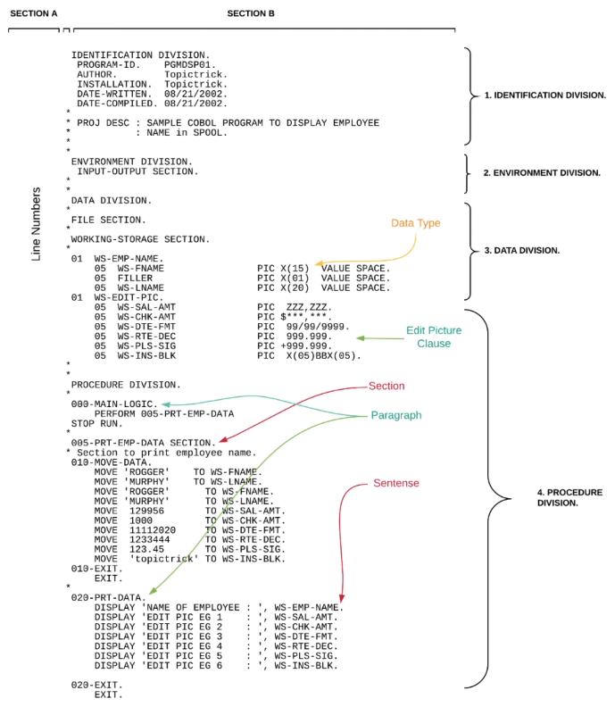
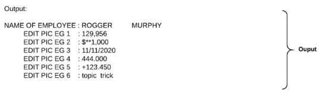

## Data Types

Trong COBOL, chỉ có ba kiểu dữ liệu:

- Numeric (Số)
- Alphanumeric (Chữ-số/chuỗi văn bản)
- Alphabetic (Chữ cái).

Edited Numeric (Số đã được chỉnh sửa) và Edited Alphanumeric (Chữ-số đã được chỉnh sửa) là hai danh mục con của Data Types được sử dụng cho việc lập báo cáo.

### Variable

Biến là một mục dữ liệu; giá trị của nó có thể thay đổi trong suốt chương trình. Tuy nhiên, các giá trị bị giới hạn bởi kiểu dữ liệu mà bạn định nghĩa khi đặt tên và độ dài cho biến.

```
01 Customer-Name Pic X(20).
```

### Literals (Giá trị nguyên)

Giá trị nguyên là một chuỗi ký tự mà giá trị của nó được xác định chính bởi các ký tự đó.

Vd: Di chuyển chuỗi "MURPHY" vào Biến Customer-Name

```
MOVE "MURPHY" TO Customer-Name
```

### Constants

Hằng số là một mục dữ liệu chỉ có một giá trị duy nhất. Ngôn ngữ COBOL không định nghĩa một cấu trúc đặc biệt dành riêng cho hằng số.

```
01 Interest PIC 9(02) VALUE 10
```

### Định nghĩa tên biến / dữ liệu

Để định nghĩa một tên dữ liệu, bạn cần có Level Number (Số Cấp độ), PICTURE Clause (Mệnh đề PICTURE) và VALUE Clause (Mệnh đề VALUE).

Quy tắc (giản lược): hãy sử dụng chữ cái, số, và dấu gạch nối với tối đa 30 ký tự trong mỗi tên.

#### PICTURE Clause

Mệnh đề PICTURE định nghĩa kiểu dữ liệu và kích thước bộ nhớ cần thiết cho một mục dữ liệu.

Nó được ký hiệu bằng từ PICTURE (viết tắt là PIC) và chỉ được sử dụng cho các mục dữ liệu cơ bản (elementary data items).

Sau đây là các ký tự PICTURE phổ biến và ý nghĩa của chúng.

Mô tả Mệnh đề PICTURE:

- A cho dữ liệu chữ cái (alphabetic)
- X cho dữ liệu chữ-số (alphanumeric)
- 9 cho dữ liệu số (numeric)
- S cho dấu (sign, tức là dấu cộng hoặc trừ)
- V cho dấu thập phân ngầm định (implied decimal point)

#### VALUE Clause

Mệnh đề VALUE được sử dụng để chỉ định giá trị ban đầu cho một mục dữ liệu và nó là một mệnh đề tùy chọn (optional).

Giá trị ban đầu có thể là giá trị nguyên là số (numeric literal), giá trị nguyên không phải là số (non-numeric literal), hoặc một hằng số hình tượng (figurative constant).

Vd: biến WS-NAME được khai báo là chuỗi ký tự dài 10 và được gán giá trị ban đầu là 'TOPIC'

```
DATA DIVISION.
WORKING-STORAGE SECTION.
*
01 WS-NAME PIC X(10) VALUE 'TOPIC'.
```

#### Data name examples

```
DATA DIVISION.
WORKING-STORAGE SECTION.
*
01 WS-NAME PIC X(10) VALUE 'TOPIC'.

*
01 WS-EMP-REC.
05 WS-FNAME PIC X(10) VALUE 'DAVID'.
05 FILLER PIC X(01) VALUE '-'.
05 WS-LNAME PIC X(10) VALUE 'MURPHY'.
05 WS-SAL PIC 9(09)V99 VALUE ZEROES.

*
01 WS-EMP-ADD PIC X(40) VALUE SPACES.
77 WS-INT-RTE PIC S9(01)V99 VALUE -1.22.
*
01 WS-SWITCH PIC X(01) VALUE 'N'.
88 END-OF-FL VALUE 'Y'.
88 NOT-END-FL VALUE 'N'.
```

Trong đó biến đơn (Scalar Variables) bao gồm:

- **01 WS-NAME PIC X(10) VALUE 'TOPIC'.** -> Chuỗi 10 ký tự (X), default là 'TOPIC'.
- **77 WS-INT-RTE PIC S9(01)V99 VALUE -1.22.**  
   -> 1 chữ số nguyên có dấu S9(01), dấu thập phân ngầm (V), 2 chữ số thập phân (99), default là -1.22.
- **01 WS-EMP-ADD PIC X(40) VALUE SPACES.** -> Chuỗi 40 ký tự, default là SPACE.

Khai báo bản ghi (Record Group) bao gồm:

- **01 WS-EMP-REC.** -> Tên của Record Group
- **05 WS-FNAME PIC X(10) VALUE 'DAVID'.** -> Chuỗi 10 ký tự, default là 'DAVID'
- **05 FILLER PIC X(01) VALUE '-'.** -> Chuỗi 1 ký tự, default là '-'.
- **05 WS-LNAME PIC X(10) VALUE 'MURPHY'.** -> Chuỗi 10 ký tự, default là 'MURPHY'
- **05 WS-SAL PIC 9(09)V99 VALUE ZEROES.** -> Số có 9 chữ số nguyên (9(09)) dấu thập phân ngầm (V) và 2 chữ số thập phân (99).

Khai báo Flag và Condition (cấp độ 88) bao gồm:

- **01 WS-SWITCH PIC X(01) VALUE 'N'.** -> Chuỗi 1 ký tự (X(01)), default là 'N'.
- **88 END-OF-FL VALUE 'Y'.** -> Nếu WS-SWITCH có giá trị 'Y', điều kiện END-OF-FL sẽ Đúng.
- **88 NOT-END-FL VALUE 'N'.** -> Nếu WS-SWITCH có giá trị 'N', điều kiện NOT-END-FL sẽ Đúng.

_Thay vì viết IF WS-SWITCH = 'Y', có thể viết IF END-OF-FL.<br/> Đây là một kỹ thuật đặc trưng của COBOL để làm cho mã dễ đọc hơn bằng cách định nghĩa một Tên Điều kiện thay vì kiểm tra trực tiếp giá trị của biến._

#### COBOL Edited Picture Clause

Mệnh đề Edited Picture là các mệnh đề picture đặc biệt dùng để định dạng dữ liệu theo khuôn mẫu mong muốn (tức là cho màn hình, máy in hoặc báo cáo).

Có hai phương pháp chỉnh sửa chung trong một mệnh đề PICTURE:

- Insertion (Chèn): Là nơi bạn chèn các ký hiệu đặc biệt như ký hiệu tiền tệ ($\$, \text{€}$), dấu hoa thị (\*), CR (Credit/Có), DR (Debit/Nợ), v.v.
- Suppression and Replacement (Loại bỏ và Thay thế ): Là nơi bạn cần phải thay thế hoặc loại bỏ một giá trị nhất định trên các báo cáo.

**Quan trọng: Thuật ngữ edited được sử dụng bởi vì mệnh đề picture chỉnh sửa định dạng lại dữ liệu.**

#### Tổng quan về Insertion

| Ký hiệu Chỉnh sửa | Loại Chỉnh sửa          |
| ----------------- | ----------------------- |
| , B o /           | Chèn đơn giản           |
| .                 | Chèn đặc biệt           |
| + - CR DB $       | Chèn cố định            |
| + - $             | Chèn nổi                |
| Z \*              | Suppression và thay thế |

#### Simple Insertion

| Ký hiệu | Ý nghĩa                   | Ví dụ                            | Giải thích                                                                |
| ------- | ------------------------- | -------------------------------- | ------------------------------------------------------------------------- |
| `,`     | Dấu phân tách hàng nghìn  | `9(6)V99` với `PIC Z,ZZZ,ZZ9.99` | Hiển thị dấu phẩy để ngăn cách phần nghìn. Ví dụ: `1234567` → `1,234,567` |
| `B`     | Chèn khoảng trống (blank) | `PIC 99B99`                      | Chèn một khoảng trắng giữa hai nhóm số.                                   |
| `0`     | Chèn số 0 cố định         | `PIC 99/00`                      | Hiển thị số 0 tại vị trí cố định trong mẫu.                               |
| `/`     | Chèn dấu gạch chéo        | `PIC 99/99/9999`                 | Thường dùng cho định dạng ngày tháng: `12252020` → `12/25/2020`.          |

#### Special Insertion

| Ký hiệu | Ý nghĩa                       | Ví dụ        | Giải thích                                                                  |
| ------- | ----------------------------- | ------------ | --------------------------------------------------------------------------- |
| `.`     | Dấu thập phân (decimal point) | `PIC 999.99` | Được dùng để xác định vị trí dấu thập phân khi hiển thị dữ liệu có phần lẻ. |

**Lưu ý: Trong COBOL, dấu thập phân có thể tự động chuyển thành dấu phẩy hoặc dấu chấm tùy vào locale.**

#### Fixed Insertion

| Ký hiệu | Ý nghĩa                                         | Ví dụ         | Giải thích        |
| ------- | ----------------------------------------------- | ------------- | ----------------- |
| `+`     | Hiển thị dấu cộng (+) cho số dương              | `PIC +999`    | `123` → `+123`    |
| `-`     | Hiển thị dấu trừ (-) cho số âm                  | `PIC -999`    | `-123` → `-123`   |
| `CR`    | Hiển thị ký hiệu “CR” (Credit) cho giá trị âm   | `PIC 999CR`   | `-123` → `123CR`  |
| `DB`    | Hiển thị ký hiệu “DB” (Debit) cho giá trị dương | `PIC 999DB`   | `123` → `123DB`   |
| `$`     | Hiển thị ký hiệu đô la ở vị trí cố định         | `PIC $999.99` | `123` → `$123.00` |

#### Floating Insertion

| Ký hiệu            | Ý nghĩa                                                            | Ví dụ           | Giải thích          |
| ------------------ | ------------------------------------------------------------------ | --------------- | ------------------- |
| `$` (nổi)          | Ký hiệu tiền tệ "trôi" về bên trái số đầu tiên không bị triệt tiêu | `PIC $*,**9.00` | `317` → `$**317.00` |
| `+` hoặc `-` (nổi) | Dấu cộng/trừ chỉ hiển thị bên trái chữ số đầu tiên                 | `PIC -ZZ9`      | `12` → `- 12`       |

#### Suppression và Replacement

| Ký hiệu | Ý nghĩa                                        | Ví dụ            | Giải thích          |
| ------- | ---------------------------------------------- | ---------------- | ------------------- |
| `Z`     | Triệt tiêu số 0 ở đầu (thay bằng khoảng trắng) | `PIC Z,ZZ9`      | `8317` → `8,317`    |
| `*`     | Triệt tiêu số 0 ở đầu (thay bằng dấu `*`)      | `PIC ***,***.99` | `317` → `***317.00` |

Ví dụ:

```
DATA DIVISION.
WORKING-STORAGE SECTION.
*
01 WS-TAX-AMT PIC Z,ZZ9.
01 WS-TOT-AMT PIC $**,**9.00.
01 WS-INT-RTE PIC 99/99/9999.
```

Result:

```
| Input        | Output          |
|--------------|-----------------|
| 8317         | 8,317           |
| 317          | $**317.00       |
| 12252020     | 12/25/2020      |
```




