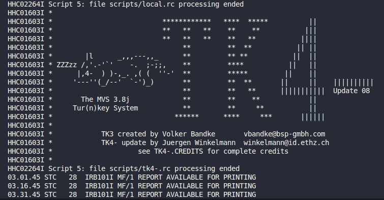
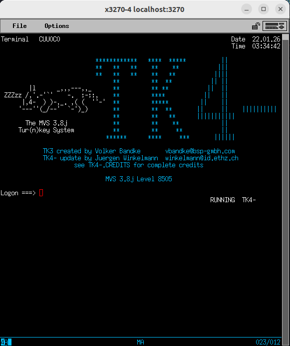
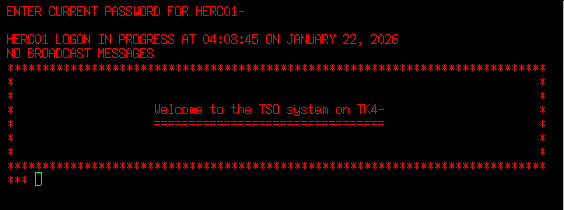
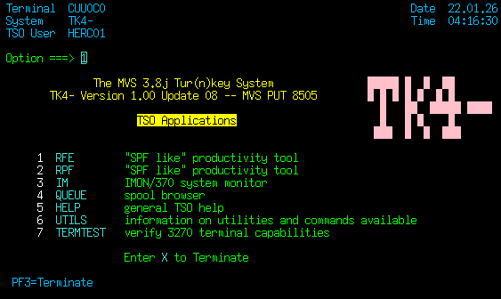
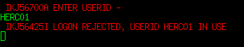

## Lưu ý

Trong phần thực hành này dùng Terminal 3270, các system IBMi hiện tại đều lên sử dụng 5250 rồi nên có thể các command hoặc phím function không phù hợp nữa, nhưng dùng để học syntax vẫn oke.

Để mô phỏng Mainframe thì sẽ sẽ cần 2 phần chính:

- MF processor emulator: là phần mềm giả lập mainframe processor, dùng để tạo môi trường Mainframe giả trên Windows, Mac hoặc Linux.

  - Vd: Hercules, TurboHercules, ShadowHercules,....

- MF terminal emulator: mô phỏng thiết bị đầu cuối IBM Mainframe, cho phép giả lập tương tác với mainframe terminal.
  - Vd: Ericom, x3270, Mocha3270, Vista TN3270,....

Còn trong dự án thực tế sẽ dùng IBM Access Client Solutions để kết nối đến IBM System. Phần mềm này có bản quyền và account cũng phải request mới được cấp.

## Cài đặt Hercules MF Emulator Ubuntu

Còn nếu cài Windows thì tham khảo: [Link Udemy](https://gmorunsystemjp.udemy.com/course/mainframe-the-complete-cobol-course-from-beginner-to-expert/learn/lecture/10841360#overview)

### 1. Cài đặt Hercules

```cmd
sudo apt update
sudo apt install hercules
```

Kiểm tra version

```cmd

hercules --version

Hercules Version 3.13
...
```

### 2. Cài đặt Terminal 3270

```cmd
sudo apt install x3270 c3270
```

### 3. Cài đặt MVS 3.8J Turnkey 4- (TK4-)

Tạo thư mục mainframe:

```cmd
mkdir -p ~/mainframe
cd ~/mainframe
```

Cài TK4:

```cmd
git clone https://github.com/actualquak/tk4.git
```

cấp quyền thực thi file `mvs`

```cmd
cd ~/mainframe/tk4
chmod +x mvs
```

Tạo folder log

```cmd
mkdir ~/mainframe/log
```

Tạo folder `/log` để tránh lỗi khi run file `mvs`

Khởi chạy file `mvs`

```cmd
./mvs
```

Kết quả chạy như bên dưới là thành công:



### 4. Cài terminal x3270

```bash
sudo apt install x3270
```

Khởi chạy terminal 3270

```bash
x3270 localhost:3270
```

Kết quả chạy như bên dưới là thành công:



Để đăng nhập thì tiếp tục nhấn Enter và nhập 2 bước account và password, đọc file `.env` để lấy thông tin đăng nhập.



Nhấn Enter 2 lần nữa để vào màn hình chính



**Lưu ý**: Thao tác log-in và log-off phải thực hiện đúng cách để tránh bị treo. Khi không làm việc nữa, nên tập thoái quen gõ LOGOFF thay vì chỉ tắt cửa sổ x3270.



Nếu lỡ tắt thì chạy lại lệnh bên dưới rồi nhập lại mật khẩu

```bash
LOGON HERC01 RECONNECT
```
