## Kiến trúc lưu trữ của Mainframe

IBM i dùng object-based architecture.

```
System
 └── Library
      └── Object
```

**Library**

Library giống như folder / namespace. Vd các thư viện như: QSYS, QGPL, MYLIB.

**Object**

Mọi thứ trong IBM i đều là object.

| Object   | Ý nghĩa                  |
| -------- | ------------------------ |
| \*PGM    | chương trình đã compile  |
| \*FILE   | file dữ liệu hoặc source |
| \*LIB    | library                  |
| \*MODULE | module code              |
| \*SRVPGM | service program          |

## Source code được lưu như thế nào?

Trên IBM i, source code được lưu trong Source Physical File. Trong Source File chứa nhiều Member - giống như file trong folder vậy.

```
Library
 └── Source File (QCBLLESRC)
        └── Member
             └── Source code lines
```

Ví dụ

```
MYLIB
 └── QCBLLESRC
        └── HELLO (File COBOL)
```

MYLIB trong ví dụ bên dưới sẽ là `SHOUYA011`

**Compile**

COBOL không chạy trực tiếp từ source. Phải compile thành object program trước khi CALL.

```
System
 └── Library
      ├── Source file (*FILE)
      │     └── Member (source code)
      │
      └── Program (*PGM)
```

Ví dụ

```
SHOUYA011/QCBLLESRC(HELLO)
       ↓ compile
SHOUYA011/HELLO (*PGM)
```

HELLO trong QCBLLESRC phải được compile thành file program cùng tên là HELLO bằng lệnh `CRTBNDCBL`.

## Viết chương trình HELLOWORLD đầu tiên trên tn5250j

Từ màn hình chính, gõ lệnh sau để vào màn hình Library list:

```
DSPLIBL
```

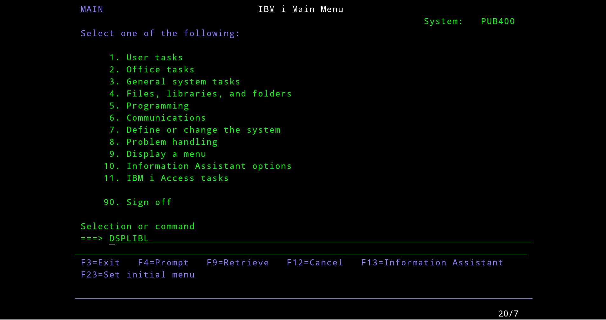

Từ đây có thể xem được library default mà Pub400 tạo sẵn. Nhấn F3 để back lại bước trước.

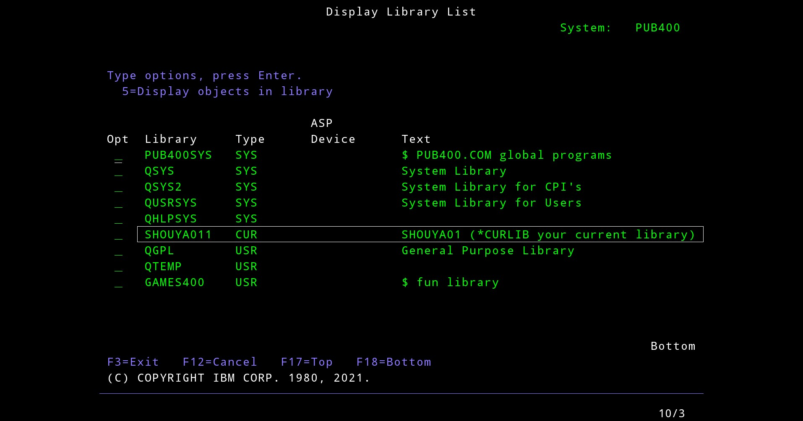

Ở bất kỳ màn hình nào có dòng lệnh ===>, tạo source bằng lệnh sau:

```cobol
CRTSRCPF FILE(MYLIB/QCBLLESRC) RCDLEN(112)
```

Nhấn Enter thì hệ thống sẽ tạo Source File.

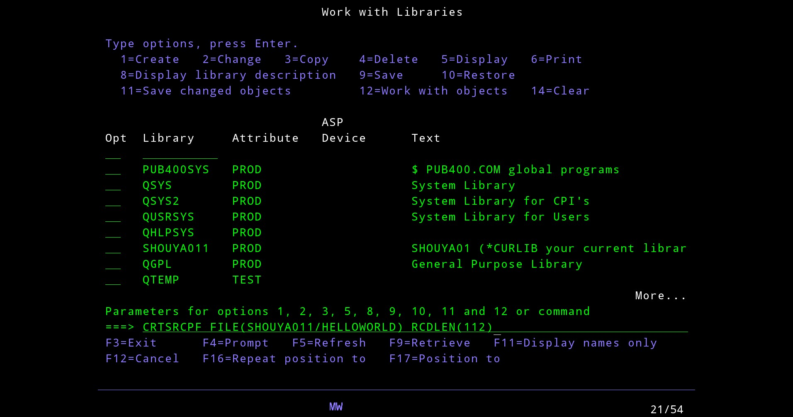

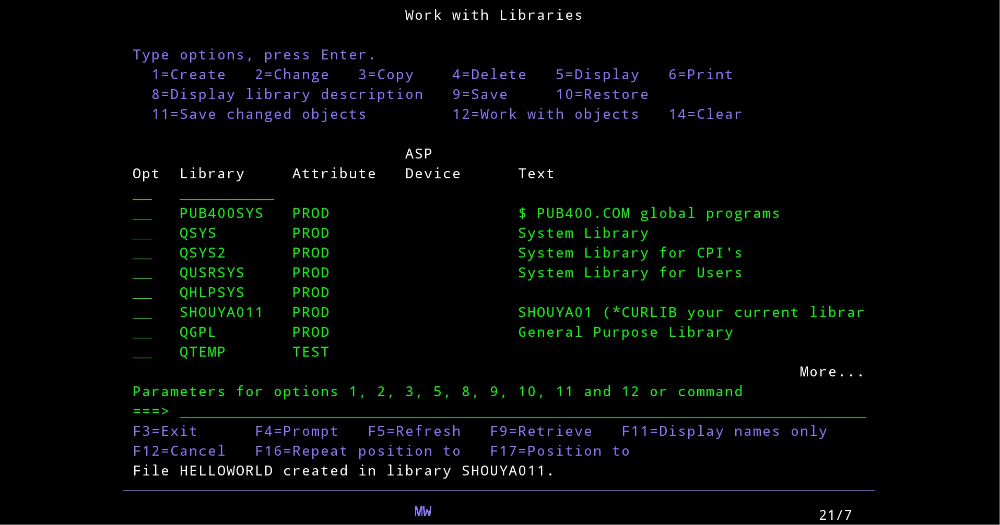

Tiếp theo là tạo Member bằng lệnh sau rồi nhấn Enter:

```cobol
WRKMBRPDM HELLOWORLD
```

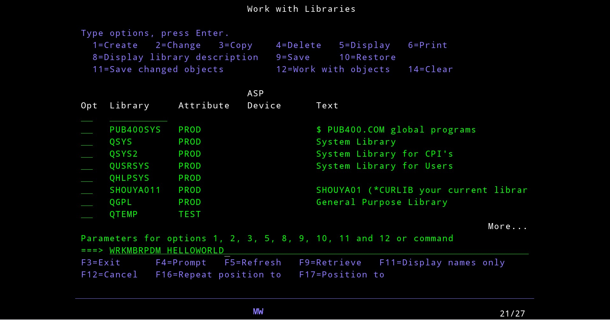

Sau đó hệ thống sẽ chuyển sang màn hình Work with Members using PDM

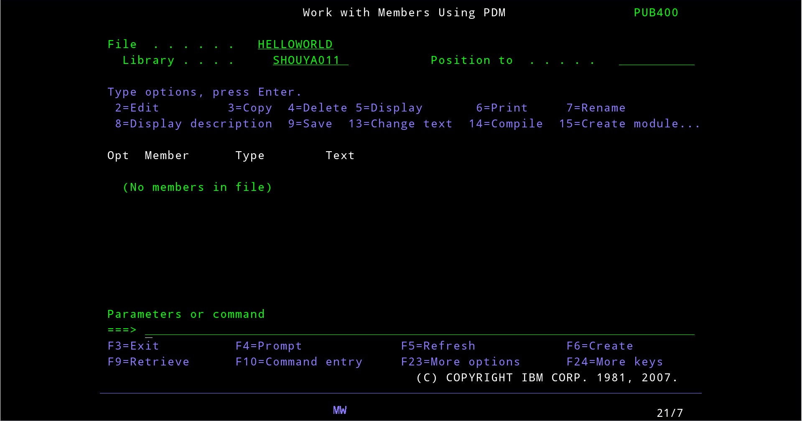

Nhấn F6 để tạo File mới, hệ thống sẽ chuyển sang màn hình Start Source Entry with Utility.

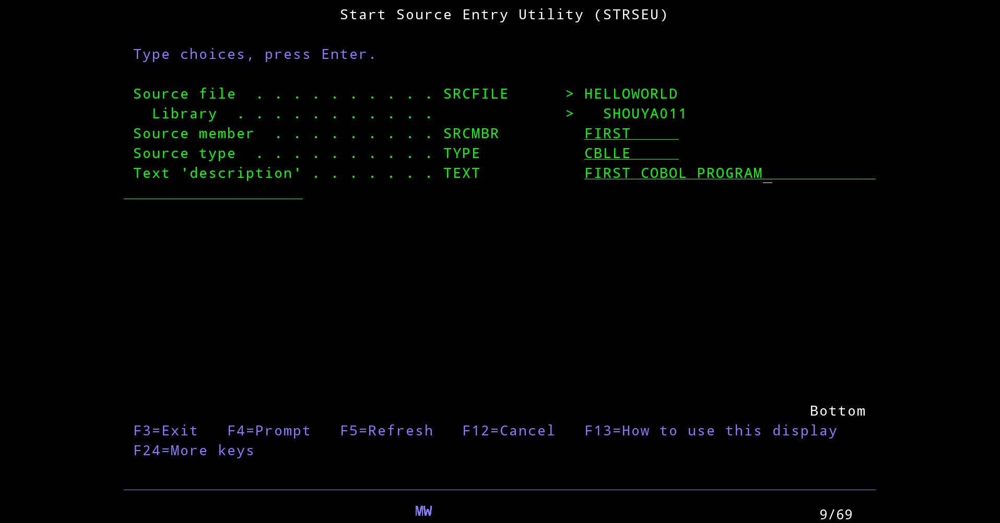

Ở bất kỳ màn hình nào có dòng lệnh ===>, chỉ cần gõ lệnh sau để tạo File.

```
WRKMBRPDM FILE(SHOUYA011/HELLOWORLD)
```

Nhập các thông tin như trên ảnh. Source type đặt là `CBLLE` tức là ILE COBOL (loại phổ biến hiện nay) hoặc là `CBL` (dành cho phiên bản cũ hơn). Sau đó nhấn Enter sẽ vào được màn hình Edit file.

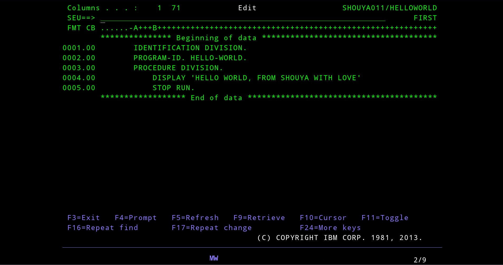

Đến đây thì có thể code COBOL rồi, lưu ý bắt đầu code ở cột A.

Sau đó bấm F3 để tiến hành lưu file. Gõ Y ở dòng Change/create member để lưu file này lại rồi nhấn Enter.

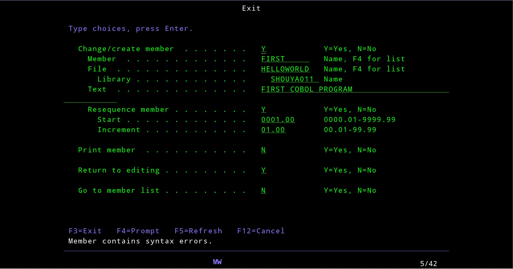

Quay lại màn hình chính và sẽ thấy File được lưu.

Tiếp theo trỏ chuột vào cột Opt, gõ 14 và nhấn Enter.

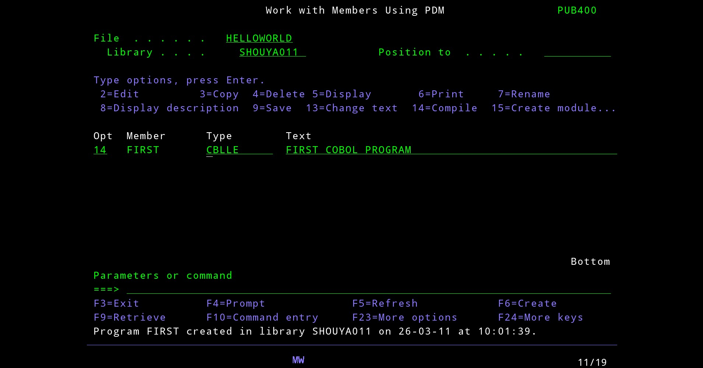

Xóa số 14 đi rồi gõ lệnh sau để gọi

```
CALL PGM(SHOUYA011/FIRST)
```

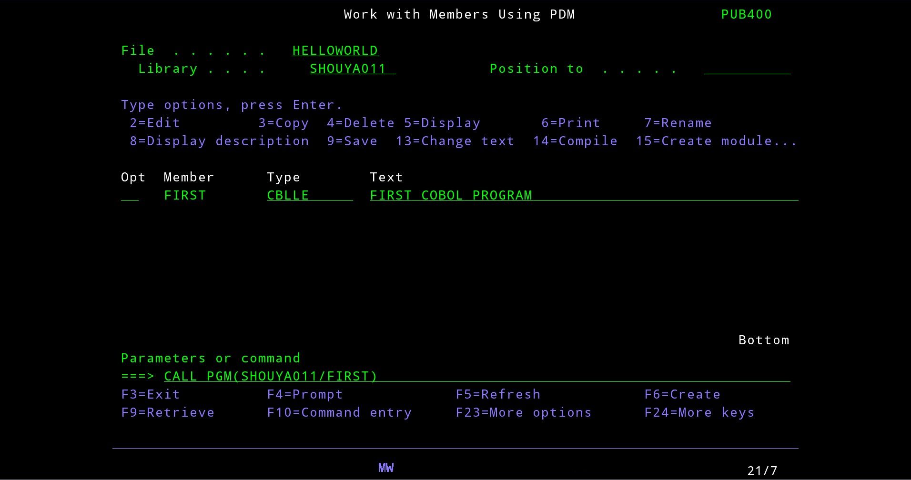

Và kết quả là

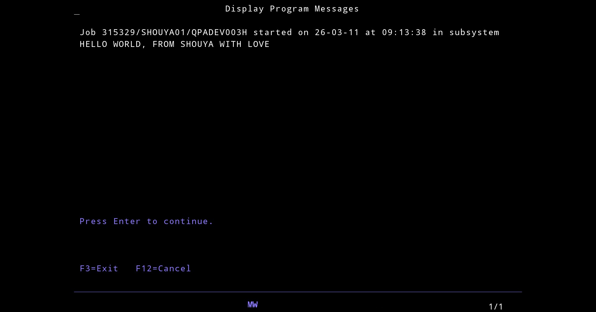

Khi muốn thoát, nhấn F3 liên tục để thoát về màn hình chính, gõ lệnh `90` để sign off đúng cách.

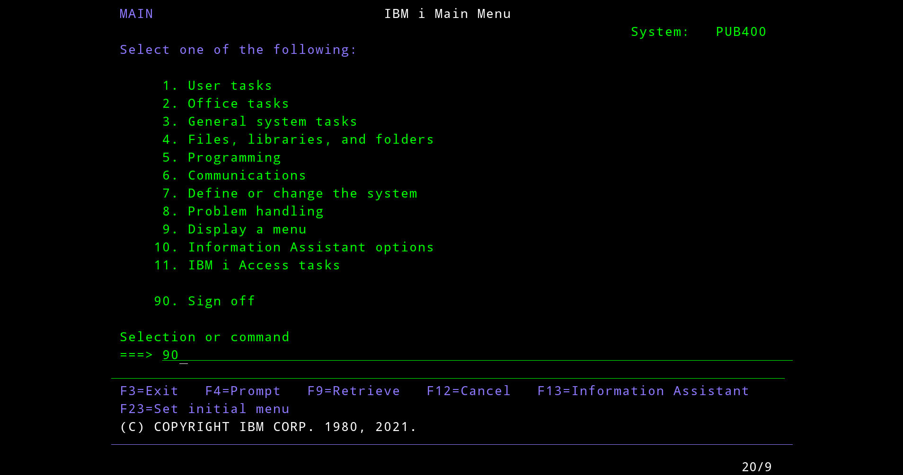
