## Sử dụng STRSQL thao tác CRUD DB2 for i

```cobol
STRSQL
```

Sau khi chạy, hệ thống sẽ hiển thị màn hình “Enter SQL Statements”.

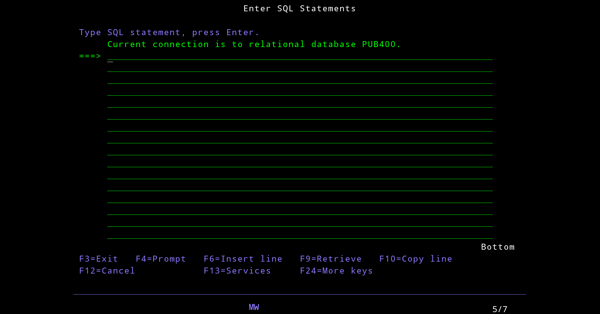

Tạo table STUDENTS

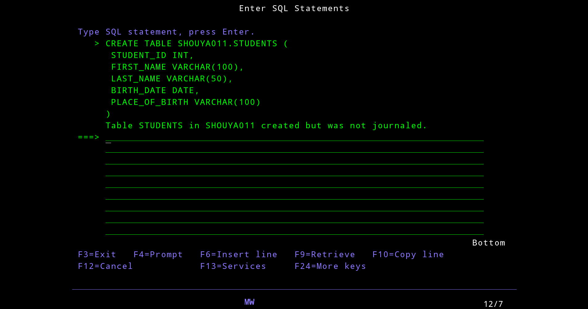

```sql
CREATE TABLE SHOUYA011.STUDENTS (
    STUDENT_ID INT GENERATED ALWAYS AS IDENTITY,
    FIRST_NAME VARCHAR(50),
    LAST_NAME VARCHAR(50),
    BIRTH_DATE DATE,
    PLACE_OF_BIRTH VARCHAR(100)
);

INSERT INTO SHOUYA011.STUDENTS (FIRST_NAME, LAST_NAME, BIRTH_DATE, PLACE_OF_BIRTH)
VALUES ('Quyen', 'Nguyen', '2000-01-01', 'Da Nang');

INSERT INTO SHOUYA011.STUDENTS (FIRST_NAME, LAST_NAME, BIRTH_DATE, PLACE_OF_BIRTH)
VALUES ('Taro', 'Yamada', '1998-05-20', 'Tokyo');

SELECT * FROM SHOUYA011.STUDENTS;

UPDATE SHOUYA011.STUDENTS
SET PLACE_OF_BIRTH = 'Ha Noi'
WHERE FIRST_NAME = 'Quyen';

DELETE FROM SHOUYA011.STUDENTS WHERE FIRST_NAME = 'Quyen';
```

Tạo journal receiver

```cobol
CRTJRNRCV JRNRCV(SHOUYA011/JRNRCV1)
```

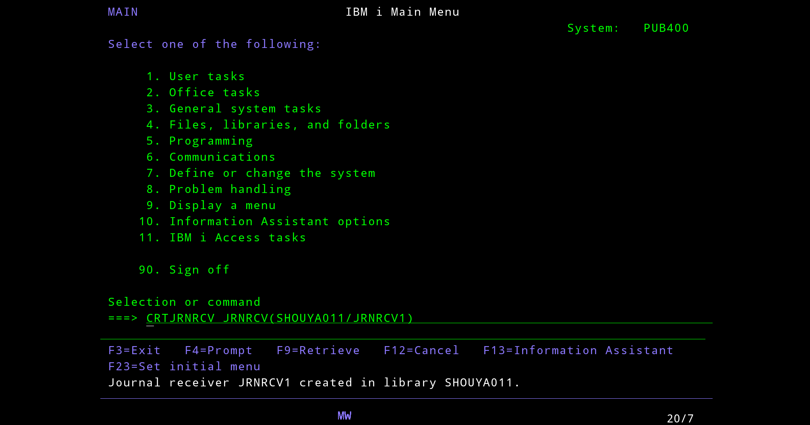

Tạo journal

```
CRTJRN JRN(SHOUYA011/JRN1) JRNRCV(SHOUYA011/JRNRCV1)
```

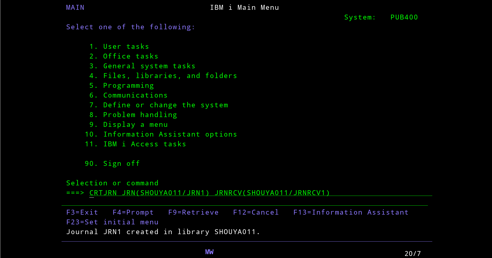

Gắn file vào journal

```
STRJRNPF FILE(SHOUYA011/STUDENTS) JRN(SHOUYA011/JRN1)
```

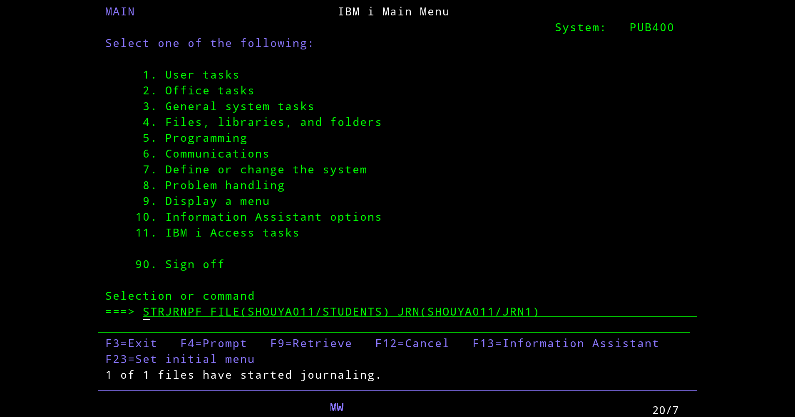

### Viết SEU để đọc file STUDENT

```cobol
STRSEU SRCFILE(SHOUYA011/QCBLLESRC) SRCMBR(READSTU) TYPE(CBLLE)
```

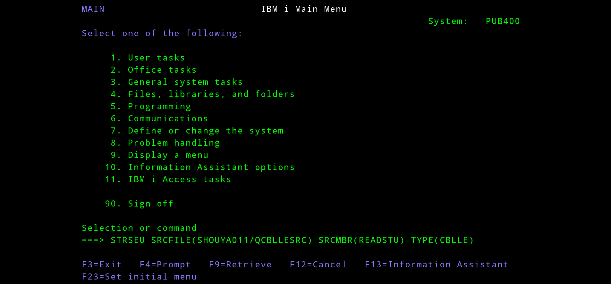
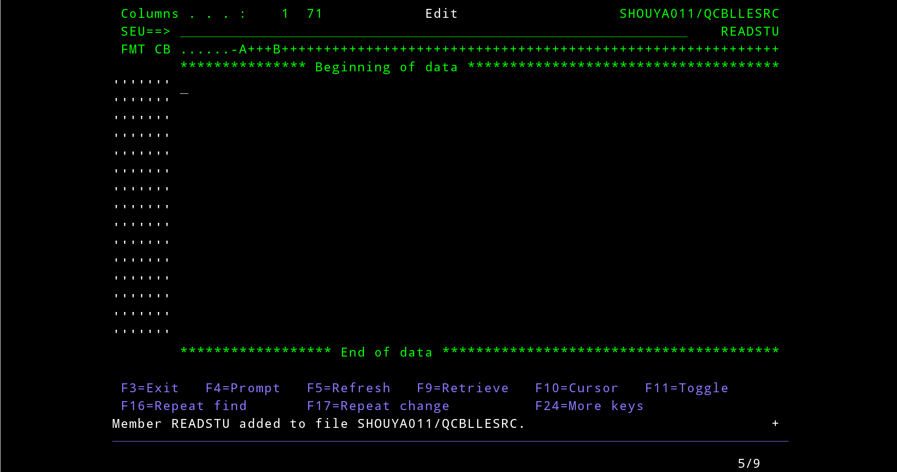

Coding tip:

- Nếu có lỗi syntax phát sinh thì dòng đó sẽ bị bôi xanh -> cần fix.
- Muốn insert dòng thì trỏ vào cột, gõ `i + <số cột muốn insert> + Enter`

Sample code

```cobol
IDENTIFICATION DIVISION.
PROGRAM-ID. READSTU.

DATA DIVISION.
WORKING-STORAGE SECTION.

EXEC SQL INCLUDE SQLCA END-EXEC.

EXEC SQL BEGIN DECLARE SECTION END-EXEC.
01 WS-STUDENT-ID     PIC S9(9) COMP.
01 WS-FIRST-NAME     PIC X(50).
01 WS-LAST-NAME      PIC X(50).
01 WS-BIRTH-DATE     PIC X(10).
01 WS-PLACE          PIC X(100).
EXEC SQL END DECLARE SECTION END-EXEC.

PROCEDURE DIVISION.

    EXEC SQL
        DECLARE C1 CURSOR FOR
        SELECT STUDENT_ID,
                FIRST_NAME,
                LAST_NAME,
                CHAR(BIRTH_DATE),
                PLACE_OF_BIRTH
        FROM SHOUYA011.STUDENTS
    END-EXEC.

    EXEC SQL OPEN C1 END-EXEC.

    PERFORM UNTIL SQLCODE NOT = 0

        EXEC SQL
            FETCH C1 INTO
                :WS-STUDENT-ID,
                :WS-FIRST-NAME,
                :WS-LAST-NAME,
                :WS-BIRTH-DATE,
                :WS-PLACE
        END-EXEC

        IF SQLCODE = 0 THEN
            DISPLAY WS-FIRST-NAME " " WS-LAST-NAME
        END-IF

    END-PERFORM.
    EXEC SQL CLOSE C1 END-EXEC.
    STOP RUN.
```

Gõ save -> Enter trên chỗ SEU ===> để lưu lại.

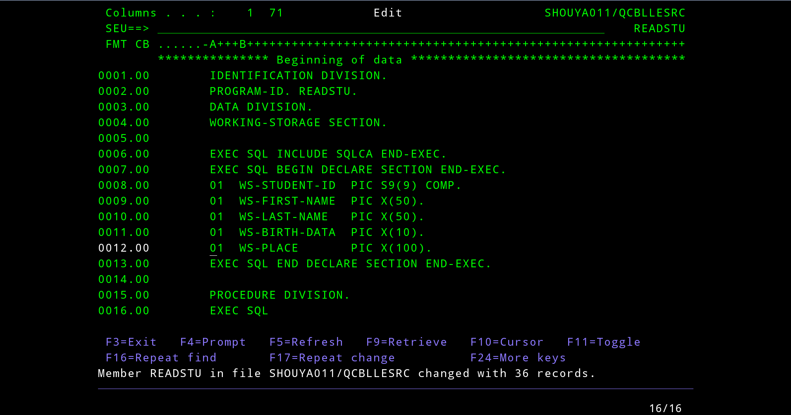

Biên dịch SEU

```cobol
CRTSQLCBL PGM(SHOUYA011/READSTU) SRCFILE(SHOUYA011/QCBLLESRC)
```

### Xem log lỗi SEU

Trường hợp code COBOL có lỗi biên dịch, sẽ hiển thị không đầy đủ

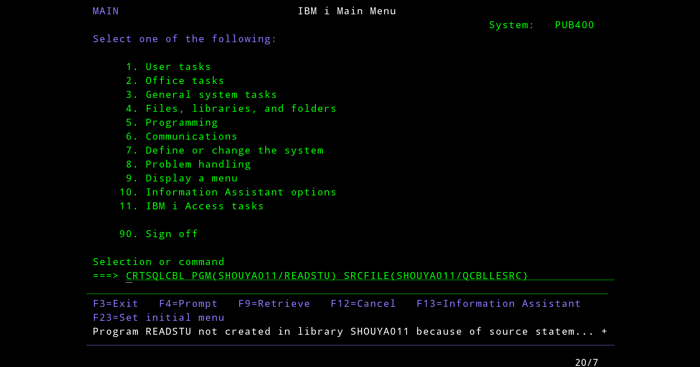

Muốn xem lỗi thì có 3 cách

```cobol
STRSEU SRCFILE(SHOUYA011/QCBLLESRC) SRCMBR(READSTU)
```

```cobol
WRKMBRPDM FILE(SHOUYA011/QCBLLESRC)
*> Tìm READSTU, nhập 2
```

```cobol
STRSEU
```

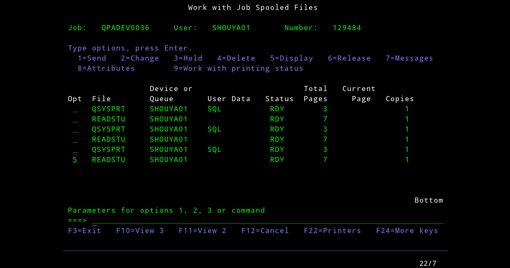

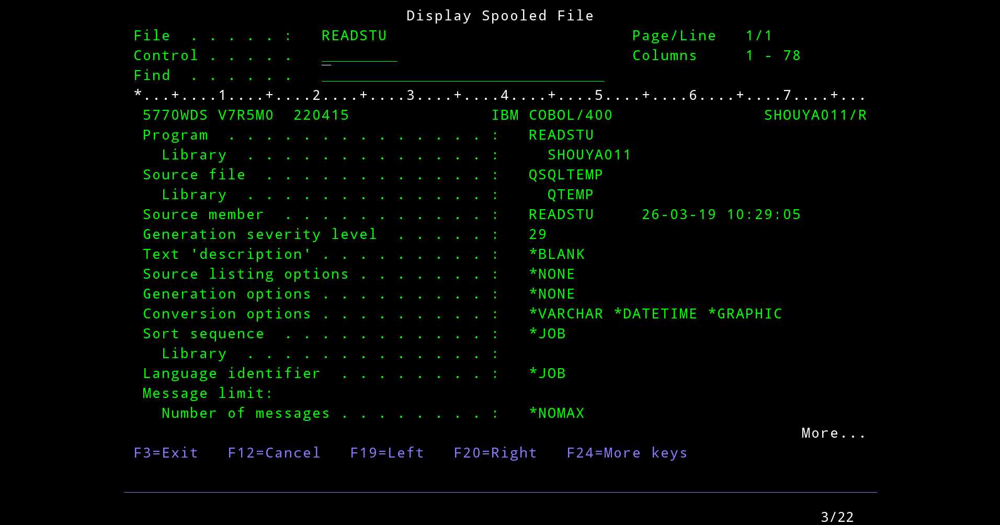

Scroll xuống để xem lỗi, nhấn Shift + F8 để sang phải, Shift + F7 để sang trái

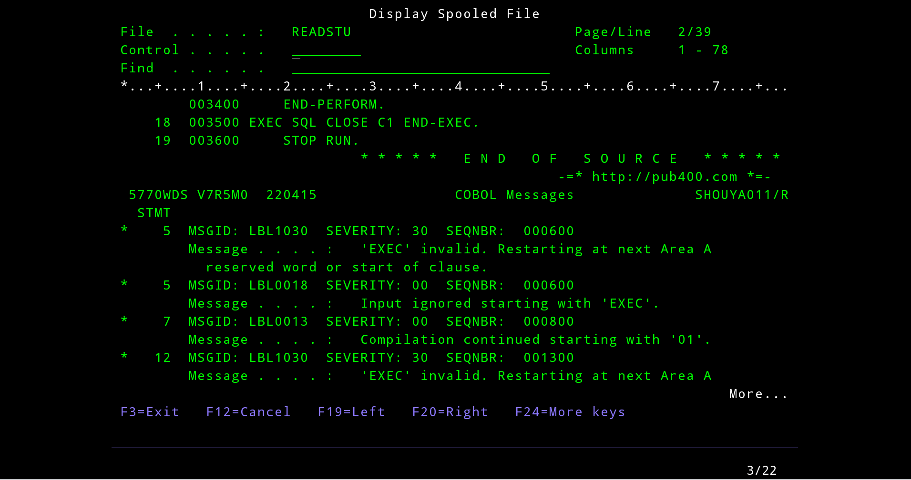

Quay lại edit SEU

```cobol
WRKMBRPDM FILE(SHOUYA011/QCBLLESRC)
```

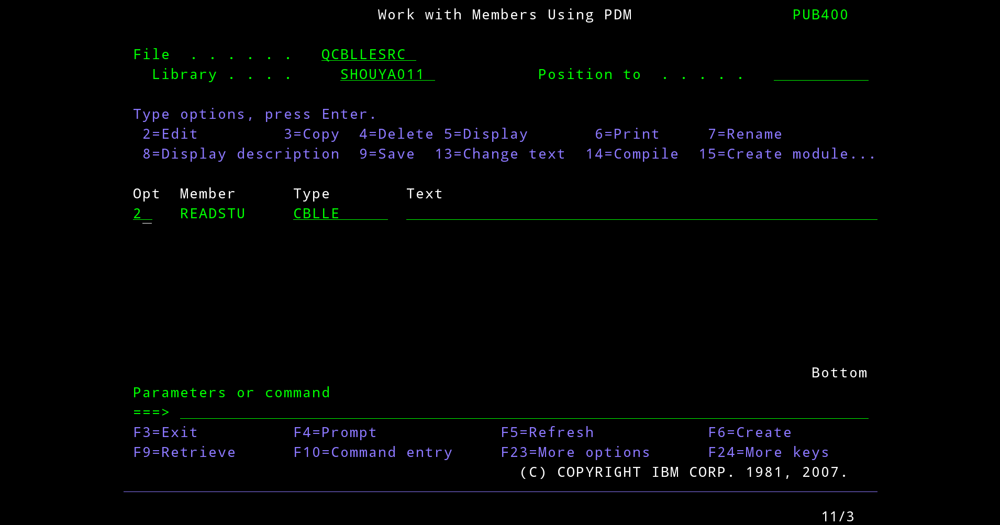
