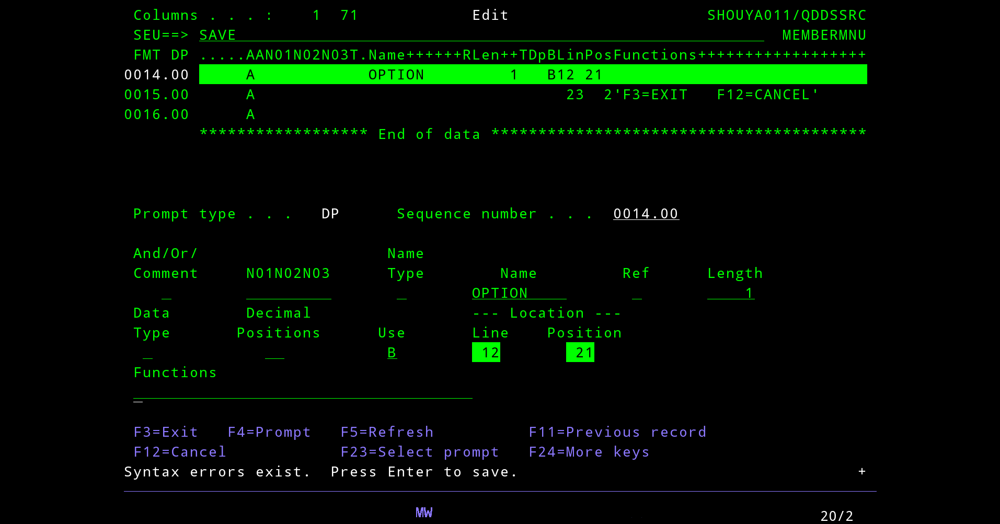
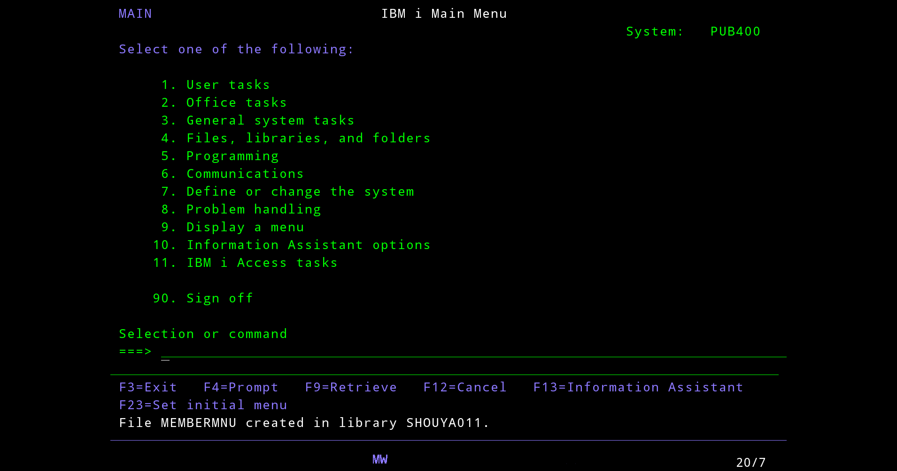
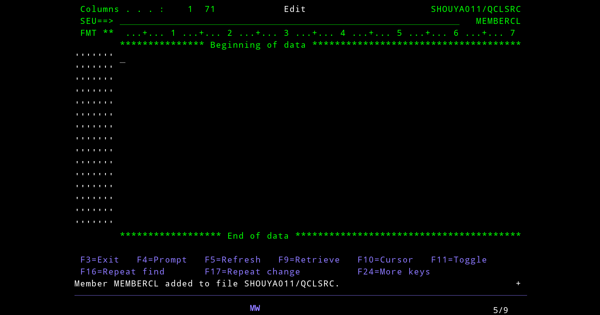
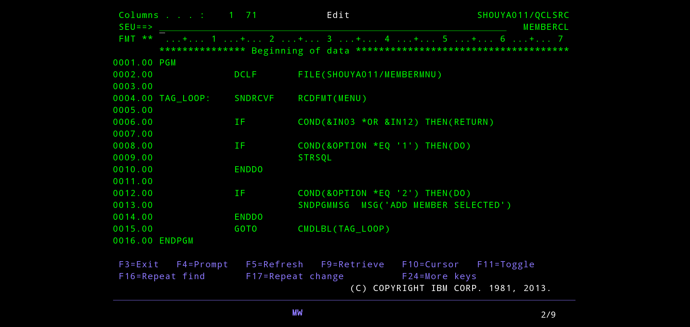
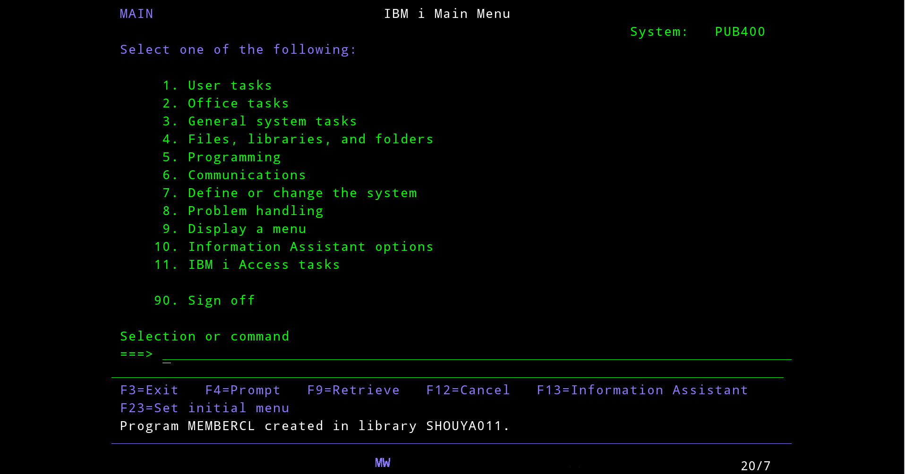
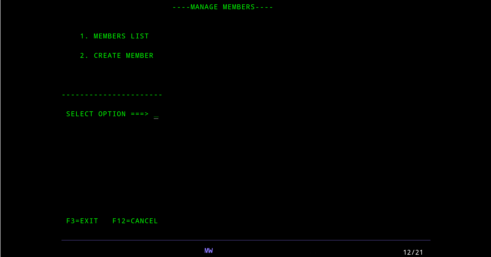
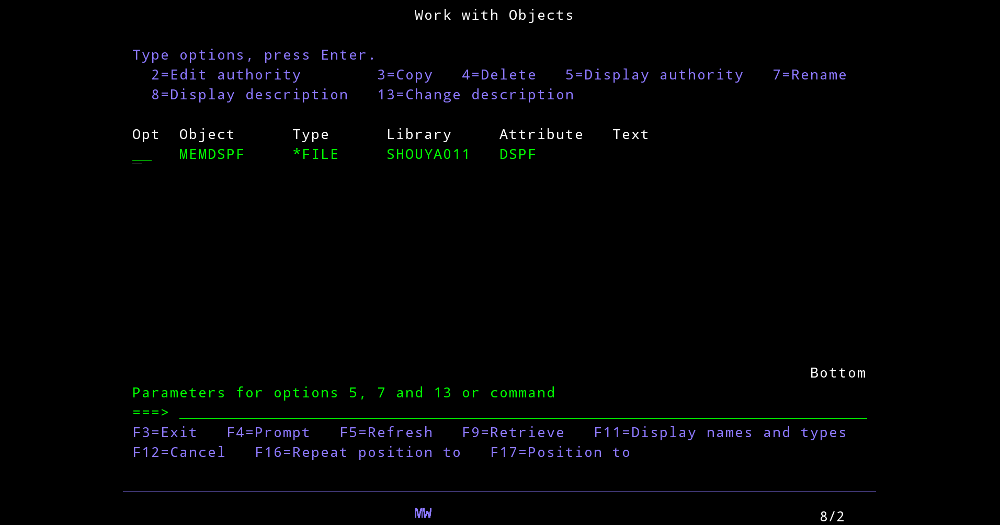
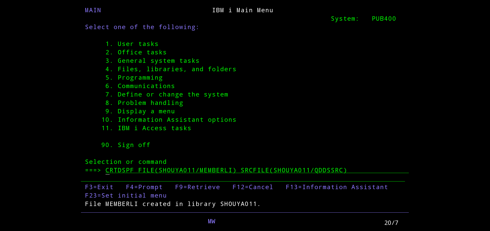

## Database

```
CREATE TABLE members (
    member_id INT PRIMARY KEY AUTO_INCREMENT,
    name VARCHAR(100),
    email VARCHAR(255) UNIQUE,
    created_at TIMESTAMP DEFAULT CURRENT_TIMESTAMP
);

CREATE TABLE categories (
    category_id INT PRIMARY KEY AUTO_INCREMENT,
    member_id INT NOT NULL,
    name VARCHAR(100) NOT NULL,
    type ENUM('income', 'expense') NOT NULL,
    FOREIGN KEY (member_id) REFERENCES members(member_id)
        ON DELETE CASCADE
);

CREATE TABLE transactions (
    transaction_id INT PRIMARY KEY AUTO_INCREMENT,
    member_id INT NOT NULL,
    category_id INT NOT NULL,
    amount DECIMAL(10,2) NOT NULL,
    note VARCHAR(255),
    transaction_date DATE NOT NULL,
    FOREIGN KEY (member_id) REFERENCES members(member_id)
        ON DELETE CASCADE,
    FOREIGN KEY (category_id) REFERENCES categories(category_id)
);
```

## Design screen

Design một màn hình đơn giản như sau cho Main Menu và Members, tương tự cho những table khác:

1. Main Menu

```
=========== PERSONAL EXPENSE SYSTEM ===========

1. MANAGE MEMBERS
2. MANAGE CATEGORIES
3. MANAGE TRANSACTIONS
4. VIEW REPORTS

----------------------------------------------
Select option ===> _

F1=Help   F3=Exit
```

2. Members Menu

```
-------------- MANAGE MEMBERS ----------------

1. MEMBERS LIST
2. CREATE MEMBER

--------------------------

Select option ===> _

F3=Back   F12=Cancel
```

3. Member List (Subfile style)

```
---------------- MEMBERS LIST ----------------

Opt  ID    Name              Email
----------------------------------------------
_    1     Quyen             quyen@example.com
_    2     John              john@gmail.com
_    3     Anna              anna@yahoo.com

----------------------------------------------
Options: 2=Edit   4=Delete

Select option ===> _

F3=Back   F5=Refresh   F12=Cancel
```

4. Create Member

```
--------------- CREATE MEMBER ---------------

Name   ===> __________________________
Email  ===> __________________________

----------------------------------------------
Press Enter to save

F3=Back   F12=Cancel
```

## Màn hình Members Menu

Muốn tạo màn hình menu tương tác thì sử dụng một loại đối tượng gọi là DDS (Data Description Specifications) để định nghĩa giao diện, cụ thể là Display File (\*DSPF).

### Bước 1: Tạo Source File chứa giao diện

Thông thường, code giao diện được đặt trong file QDDSSRC (**Q**uery **D**ata **D**escription **S**pecifications **S**ou**RC**e). Hãy tạo nếu chưa có:

```
CRTSRCPF FILE(SHOUYA011/QDDSSRC) RCDLEN(112)
```

### Bước 2: Viết code DDS bằng SEU

Tạo một Member mới tên là MEMBERMNU với Type là DSPF.

```
STRSEU SRCFILE(SHOUYA011/QDDSSRC) SRCMBR(MEMBERMNU) TYPE(DSPF)
```

```
....+....1....+....2....+....3....+....4....+....5....+....6....+....7
FMT DP  .....AAN01N02N03T.Name++++++RLen++TDpBLinPosFunctions++++++++++
        *************** Beginning of data *****************************
0001.00      A                                      DSPSIZ(24 80 *DS3)
0002.00      A                                      CA03(03 'Exit')
0003.00      A                                      CA12(12 'Cancel')
0004.00      A          R MENU
0005.00      A                                  1 25'-------------- MANAGE MEMBERS ----------------'
0006.00      A
0007.00      A                                  4  5'1. MEMBERS LIST'
0008.00      A
0009.00      A                                  6  5'2. CREATE MEMBER'
0010.00      A
0011.00      A                                 10  1'--------------------------'
0012.00      A
0013.00      A
0014.00      A                                 12  2'Select option ===>'
0015.00      A            OPTION         1   B 12 21
0016.00      A                                 23  2'F3=Exit   F12=Cancel'
0017.00      A
        ****************** End of data ********************************
```

Trong đó:

- DSPSIZ(24 80 \*DS3): Khai báo kích thước màn hình chuẩn 24 hàng x 80 cột.
- CA03(03 'Exit'): Gán phím F3 cho lệnh Exit.
- CA12(12 'Cancel'): Gán phím F12 cho lệnh Cancel.
- COLOR(BLU): Quy định màu sắc hiển thị là Blue (Xanh dương).

**Cấu trúc DDS theo cột (FMT DP)**

| Cột (Pos)   | Ký hiệu thước   | Tên đầy đủ    | Giải thích chi tiết                                                                               |
| :---------- | :-------------- | :------------ | :------------------------------------------------------------------------------------------------ |
| **6**       | **A**           | **Form Type** | **Bắt buộc:** Phải gõ chữ 'A' để xác định đây là dòng code DDS.                                   |
| **17**      | **T**           | **Type**      | Xác định loại dòng: 'R' là Record Format (tên màn hình), để trống nếu là khai báo trường (Field). |
| **19 - 28** | **Name++++++**  | **Name**      | Tên của Record (ví dụ: MENU) hoặc tên biến (ví dụ: OPTION).                                       |
| **36 - 37** | **RLen**        | **Length**    | Độ dài của biến (ví dụ: 1 cho lựa chọn menu).                                                     |
| **38**      | **T**           | **Data Type** | Kiểu dữ liệu: 'Y' là số, để trống là ký tự (Character).                                           |
| **39**      | **Dp**          | **Decimal**   | Số chữ số thập phân nếu biến là kiểu số.                                                          |
| **40**      | **B**           | **Usage**     | Cách dùng: 'B' (Both) - vừa hiện vừa nhập, 'I' (Input) - chỉ nhập, 'O' (Output) - chỉ hiện.       |
| **42 - 44** | **Lin**         | **Line**      | Tọa độ hàng trên màn hình (từ 1 đến 24).                                                          |
| **45 - 47** | **Pos**         | **Position**  | Tọa độ cột trên màn hình (từ 1 đến 80).                                                           |
| **48 - 80** | **Functions++** | **Functions** | Các từ khóa điều khiển (COLOR, CA03) hoặc nội dung chữ đặt trong dấu nháy đơn ' '.                |

Nếu canh chỉnh dòng sai, khi save / F3 thì sẽ xảy ra lỗi, dòng lỗi sẽ được bôi xanh.

Nếu chưa quen với việc căn chỉnh dòng thì hãy dùng lệnh F4, điền prompt để hệ thống tự gen source, đây là cách an toàn nhất.



### Bước 3: Compile

```
CRTDSPF FILE(SHOUYA011/MEMBERMNU) SRCFILE(SHOUYA011/QDDSSRC)
```



### Bước 4: Viết chương trình để hiển thị màn hình

Giao diện (DSPF) chỉ là cái khung, cần một chương trình (thường là CLP - Control Language Program) để gọi nó ra và xử lý lựa chọn của người dùng.

Tạo Member MEMBERCL trong file QCLSRC (hoặc QGPL/QCLSRC):

```
STRSEU SRCFILE(SHOUYA011/QDDSSRC) SRCMBR(MEMBERCL) TYPE(CLP)
```




```
PGM
             DCLF       FILE(SHOUYA011/MEMBERMNU)

TAG_LOOP:    SNDRCVF    RCDFMT(MENU)

             IF         COND(&IN03 *OR &IN12) THEN(RETURN)

             IF         COND(&OPTION *EQ '1') THEN(DO)
                STRSQL
             ENDDO

             IF         COND(&OPTION *EQ '2') THEN(DO)
                SNDPGMMSG  MSG('ADD MEMBER SELECTED')
             ENDDO

             GOTO       CMDLBL(TAG_LOOP)
ENDPGM
```

Trong đó:

**1. Cấu trúc CLP**

| Vị trí cột  | Thành phần         | Ý nghĩa và Quy tắc gõ                                                                                                   |
| :---------- | :----------------- | :---------------------------------------------------------------------------------------------------------------------- |
| **1 - 10**  | **Label (Nhãn)**   | Dùng để đặt tên điểm nhảy (ví dụ: `TAG_LOOP:`). Phải có dấu `:` ở cuối.                                                 |
| **14 - 80** | **Command (Lệnh)** | Nơi nhập các câu lệnh hệ thống (`PGM`, `DCLF`, `SNDRCVF`, `IF`).                                                        |
| **Thụt lề** | **Indentation**    | Không bắt buộc nhưng nên thụt lề 2-3 khoảng trắng cho các lệnh nằm trong cặp `DO` và `ENDDO` để dễ phân biệt khối lệnh. |

**2. Giải thích câu lệnh**

| Lệnh / Từ khóa | Loại    | Giải thích                                                                                                                                                                                      |
| :------------- | :------ | :---------------------------------------------------------------------------------------------------------------------------------------------------------------------------------------------- |
| PGM / ENDPGM   | Command | Điểm bắt đầu và kết thúc bắt buộc của chương trình.                                                                                                                                             |
| DCLF           | Command | Declare File: Khai báo file màn hình. Nó tự động tạo ra các biến có dấu `&` dựa trên file DDS.                                                                                                  |
| FILE           | Keyword | Tham số của `DCLF` để chỉ định `Thư_viện/Tên_File_DDS`.                                                                                                                                         |
| TAG_LOOP:      | Label   | Nhãn đánh dấu vị trí. Lưu ý: Phải có dấu `:` ở cuối nhãn.                                                                                                                                       |
| SNDRCVF        | Command | Viết tắt của **Send/Receive File**. Đây là lệnh "2 trong 1": vừa gửi dữ liệu ra màn hình (Send), vừa dừng chương trình lại đợi người dùng nhập rồi nhận dữ liệu về (Receive).                   |
| RCDFMT(MENU)   | Keyword | Record Format: Chỉ định tên màn hình cụ thể muốn hiển thị. Một file DDS có thể có nhiều màn hình (ví dụ: MENU, DETAIL, ERROR), phải dùng từ khóa này để báo cho hệ thống biết cần hiện cái nào. |
| SNDPGMMSG      | Command | Send Program Message: Lệnh dùng để gửi một thông báo. Thông báo này thường xuất hiện ở dòng cuối cùng (dòng 24) của màn hình. Rất hữu ích để báo lỗi hoặc xác nhận thao tác thành công.         |
| MSG('...')     | Keyword | Nội dung tin nhắn cụ thể muốn hiển thị. Phải được đặt trong dấu nháy đơn `' '`.                                                                                                                 |
| STRSQL         | Command | Start SQL: Lệnh gọi trình soạn thảo SQL tương tác. Trong bài tập này, nó giúp mở nhanh bảng dữ liệu để kiểm tra (Option 1).                                                                     |
| RETURN         | Command | Kết thúc chương trình và quay trở lại nơi đã gọi nó (trở về màn hình dòng lệnh hoặc menu trước đó). Thường dùng khi người dùng nhấn F3/F12.                                                     |
| CMDLBL(...)    | Keyword | Command Label: Chỉ định tên nhãn (Label) mà lệnh `GOTO` sẽ nhảy tới.                                                                                                                            |



### Bước 5: Biên dịch và Chạy

Biên dịch chương trình CL:

```
CRTCLPGM PGM(SHOUYA011/MEMBERCL) SRCFILE(SHOUYA011/QCLSRC)
```



Khởi động menu:

```
CALL PGM(SHOUYA011/MEMBERCL)
```



## Màn hình Menu List (Subfile)

Để tạo màn hình danh sách (List) phải sử dụng Subfile (SFL).

Một màn hình Subfile luôn cần 2 Record Format đi cùng nhau:

- **SFL (Subfile Record):** Định nghĩa 1 dòng dữ liệu
- **SFLCTL (Subfile Control):** Định nghĩa phần tiêu đề, chân trang và các phím chức năng

Tạo một Member mới tên là **MEMDSPF** với Type là **DSPF**.

```
STRSEU SRCFILE(SHOUYA011/QDDSSRC) SRCMBR(MEMDSPF) TYPE(DSPF)
```

```
 FMT A* .....A*. 1 ...+... 2 ...+... 3 ...+... 4 ...+... 5 ...+... 6 ...+... 7
        *************** Beginning of data *************************************
0001.00      A*================================================================
0002.00      A* MEMBER LIST DISPLAY FILE
0003.00      A*================================================================
0004.00      A                                      DSPSIZ(24 80 *DS3)
0005.00      A                                      INDARA
0006.00      A*----------------------------------------------------------------
0007.00      A* SUBFILE RECORD
0008.00      A*----------------------------------------------------------------
0009.00      A          R MEMSFL                    SFL
0010.00      A            SFLOPT         1A  B  7  2
0011.00      A            MEMID          5S 0O  7  6
0012.00      A            MEMNAME       15A  O  7 13
0013.00      A            MEMMAIL       30A  O  7 31
0014.00      A*----------------------------------------------------------------
0015.00      A* SUBFILE CONTROL
0016.00      A*----------------------------------------------------------------
0017.00      A          R MEMSFLCTL                 SFLCTL(MEMSFL)
0018.00      A                                      OVERLAY
0019.00      A                                      CA03(03 'EXIT')
0020.00      A                                      CF05(05 'REFRESH')
0021.00      A                                      SFLSIZ(9999)
0022.00      A                                      SFLPAG(0010)
0023.00      A  63                                  SFLDSP
0024.00      A  64                                  SFLDSPCTL
0025.00      A  61                                  SFLCLR
0026.00      A  62                                  SFLEND(*MORE)
0027.00      A*------- SUBFILE'S HEADER --------
0028.00      A                                  1 25'-------MEMBER LIST--------
0029.00      A                                  5  2'OPT'
0030.00      A                                  5  6'ID'
0031.00      A                                  5 13'NAME'
0032.00      A                                  5 31'EMAIL'
0033.00      A
0034.00      A            SFLRCDNBR      4S 0H      SFLRCDNBR
0035.00      A*----------------------------------------------------------------
0036.00      A* FOOTER
0037.00      A*----------------------------------------------------------------
0038.00      A          R MEMFT                     OVERLAY
0039.00      A                                 21  2'OPTIONS: 2=EDIT  4=DELETE'
0040.00      A                                 23  2'SELECT OPTION ====>'
0041.00      A            CMDSEL         2A  B 23 22
0042.00      A                                 24  2'F3=BACK  F5=REFRESH  F12=CANCEL
0043.00      A            MEMMSG               24 30
        ****************** End of data ****************************************
```

Trong đó:

1. Format Record

- MEMSFL (Subfile Record): Chỉ định nghĩa một dòng dữ liệu duy nhất. Hệ thống sẽ tự động lặp lại dòng này dựa trên số lượng bản ghi nạp vào.
- MEMSFLCTL (Control Record): Chứa các từ khóa điều khiển (SFLDSP, SFLCLR) và Header (tiêu đề cột).
  - Lưu ý: Header phải nằm phía trên dòng bắt đầu của Subfile.
- MEMFT (Footer Record): Chứa các hướng dẫn (F3, F12) và ô nhập lệnh (CMDSEL).

2. Keyword

- SFL / SFLCTL: Định nghĩa đây là bản ghi dữ liệu và bản ghi điều khiển Subfile.
- SFLPAG(0012): Số dòng hiển thị trên một trang màn hình. Nếu dữ liệu nhiều hơn 12, hệ thống tự kích hoạt cuộn trang.
- SFLSIZ(9999): Tổng số bản ghi tối đa mà Subfile có thể chứa trong bộ nhớ.
- SFLDSP / SFLDSPCTL:
  - SFLDSP: Cho phép hiển thị nội dung các dòng dữ liệu.
  - SFLDSPCTL: Cho phép hiển thị phần tiêu đề và điều khiển.
- SFLCLR: Khi Indicator này bật, hệ thống sẽ xóa sạch dữ liệu cũ trong Subfile để chuẩn bị nạp mới.
- SFLEND(\*MORE): Hiển thị chữ "More..." hoặc "Bottom" ở góc dưới màn hình để người dùng biết còn dữ liệu hay không.

3. UI & Display

- OVERLAY: Rất quan trọng, cho phép ghi đè Record Format này lên màn hình mà không xóa những gì đang có sẵn. Nếu không có OVERLAY, mỗi lần hiện Footer, phần Header sẽ biến mất và ngược lại.
- INDARA (Indicator Area): Tách biệt các biến Indicator (01-99) ra khỏi cấu trúc dữ liệu chính, giúp clean code.
- SFLRCDNBR: Một trường ẩn (H) giúp chương trình điều khiển vị trí con trỏ.
  - Ví dụ: Nếu đang ở trang 5 và nhấn Refresh, nhờ keyword này mà màn hình vẫn đứng yên ở trang 5 thay vì nhảy về trang 1.

4. Quy ước (cần xác minh)

- 61: Luôn dùng cho Clear (Xóa).
- 62: Luôn dùng cho End (Hiển thị chữ More/Bottom).
- 63: Luôn dùng cho Display (Hiển thị dòng dữ liệu).
- 64: Luôn dùng cho Display Control (Hiển thị tiêu đề).

### Biên dịch File màn hình (DSPF)

```
CRTDSPF FILE(SHOUYA011/MEMDSPF) SRCFILE(SHOUYA011/QDDSSRC) SRCMBR(MEMDSPF) REPLACE(*YES)
```

sử thành

```
CRTDSPF FILE(SHOUYA011/MEMDSPF) SRCFILE(SHOUYA011/QDDSSRC) SRCMBR(MEMDSPF)
```

### Xác nhận file đã tồn tại dưới dạng Object

```
WRKOBJ OBJ(SHOUYA011/MEMDSPF) OBJTYPE(*FILE)
```



Nếu báo lỗi `Cannot find object to match specified name.` là chưa được.



### Viết COBOL cho MenuList

Khi tạo màn hình Main Menu, chỉ cần dùng CLP (Control Language Program), còn lần này cần chuyển sang viết bằng COBOL. Lý do là CLP chỉ dùng để điều kiển hệ thống chứ không thể đọc DB, read record, write data subfile,... thứ mà phải dùng COBOL.

Tạo nơi chứa source COBOL nếu chưa có

```cobol
CRTSRCPF FILE(SHOUYA011/QCBLLESRC) RCDLEN(112)
```

Tạo Member

```cobol
WRKMBRPDM FILE(SHOUYA011/QCBLLESRC)
```

Nhấn F6 để tạo Source Member `MEMMGMT`, source type là `SQLCBLLE`

```cobol
 FMT CB ......-A+++B+++++++++++++++++++++++++++++++++++++++++++++++++++++++++++
        *************** Beginning of data *************************************
0001.00        IDENTIFICATION DIVISION.
0002.00        PROGRAM-ID. MEMMGMT.
0003.00        ENVIRONMENT DIVISION.
0004.00        INPUT-OUTPUT SECTION.
0005.00        FILE-CONTROL.
0006.00            SELECT DSPFILE ASSIGN TO WORKSTATION-MEMDSPF-SI
0007.00                ORGANIZATION IS TRANSACTION
0008.00                ACCESS MODE IS DYNAMIC
0009.00                RELATIVE KEY IS WS-RRN
0010.00                FILE STATUS IS WS-DSP-STATUS.
0011.00        DATA DIVISION.
0012.00        FILE SECTION.
0013.00        FD  DSPFILE.
0014.00        01  DSP-REC   PIC X(1024).
0015.00
0016.00        WORKING-STORAGE SECTION.
SQL                EXEC SQL INCLUDE SQLCA END-EXEC.
0018.00
0019.00        01  WS-RRN           PIC 9(4) COMP VALUE 0.
0020.00        01  WS-EOF           PIC X VALUE 'N'.
0021.00        01  WS-EXIT-FLG      PIC X VALUE 'N'.
0022.00        01  WS-EDIT-ID       PIC S9(5) COMP.
0023.00        01  WS-SFL-MOD-FND   PIC X VALUE 'N'.
0024.00        01  WS-VARIABLES.
0025.00            05  WS-DSP-STATUS    PIC XX.
0026.00            05  WS-LIST-MSG      PIC X(74) VALUE SPACES.
0027.00        01  DSP-IND-AREA.
0028.00            05  IN03             PIC 1 INDICATOR 03.
0029.00            05  IN05             PIC 1 INDICATOR 05.
0030.00            05  IN61             PIC 1 INDICATOR 61.
0031.00            05  IN62             PIC 1 INDICATOR 62.
0032.00            05  IN63             PIC 1 INDICATOR 63.
0033.00            05  IN64             PIC 1 INDICATOR 64.
0034.00        COPY DDS-ALL-FORMATS OF MEMDSPF.
0035.00
0036.00        01  WS-MEMBER-DB.
0037.00            05  DB-ID       PIC S9(9) BINARY.
0038.00            05  DB-NAME     PIC X(100).
0039.00            05  DB-EMAIL    PIC X(255).
0040.00
0041.00        PROCEDURE DIVISION.
0042.00        MAIN-LOGIC.
0043.00            OPEN I-O DSPFILE.
0044.00            PERFORM LOAD-SUBFILE.
0045.00            PERFORM UNTIL WS-EXIT-FLG = 'Y'
0046.00                 PERFORM DISPLAY-SCREEN
0047.00            END-PERFORM.
0048.00            CLOSE DSPFILE.
0049.00            GOBACK.
0050.00        LOAD-SUBFILE.
0051.00            MOVE 0 TO WS-RRN
0052.00            MOVE 'N' TO WS-EOF
0053.00            MOVE B'1' TO IN64
0054.00            MOVE B'0' TO IN63
0055.00            MOVE B'1' TO IN61
0056.00            WRITE DSP-REC FROM MEMSFLCTL-O FORMAT 'MEMSFLCTL'
0057.00                 INDICATORS DSP-IND-AREA
0058.00            MOVE B'0' TO IN61.
SQL                EXEC SQL
SQL                     DECLARE MEMCUR CURSOR FOR
SQL                     SELECT MEMBER_ID, NAME, EMAIL FROM SHOUYA011.MEMBERS
SQL                     ORDER BY MEMBER_ID ASC
SQL                END-EXEC.
0064.00
SQL                EXEC SQL CLOSE MEMCUR END-EXEC.
SQL                EXEC SQL OPEN MEMCUR END-EXEC.
0067.00            IF SQLCODE < 0
0068.00                  MOVE 'SQL OPEN ERROR' TO WS-LIST-MSG
0069.00                  MOVE 'Y' TO WS-EOF
0070.00            END-IF.
0071.00            PERFORM UNTIL WS-EOF = 'Y'
SQL                      EXEC SQL
SQL                          FETCH MEMCUR INTO :DB-ID, :DB-NAME, :DB-EMAIL
SQL                          END-EXEC
0075.00                  IF SQLCODE = 100
0076.00                      MOVE 'Y' TO WS-EOF
0077.00                  ELSE
0078.00                      ADD 1 TO WS-RRN
0079.00                      MOVE SPACE    TO SFLOPT   OF MEMSFL
0080.00                      MOVE DB-ID    TO MEMID    OF MEMSFL
0081.00                      MOVE DB-NAME  TO MEMNAME  OF MEMSFL
0082.00                      MOVE DB-EMAIL TO MEMMAIL  OF MEMSFL
0083.00                      WRITE SUBFILE DSP-REC FROM MEMSFL
0084.00                           FORMAT 'MEMSFL' INDICATORS DSP-IND-AREA
0085.00                      END-IF
0086.00            END-PERFORM.
SQL                EXEC SQL CLOSE MEMCUR END-EXEC.
0088.00
0089.00            IF WS-RRN > 0
0090.00                MOVE B'1' TO IN63
0091.00                MOVE B'1' TO IN64
0092.00            ELSE
0093.00                MOVE B'0' TO IN63
0094.00                MOVE B'1' TO IN64
0095.00                MOVE 'NO RESULTS FOUND' TO WS-LIST-MSG
0096.00            END-IF.
0097.00
0098.00        DISPLAY-SCREEN.
0099.00            MOVE WS-LIST-MSG TO MEMMSG OF MEMFT-O
0100.00            PERFORM LOAD-SUBFILE
0101.00            WRITE DSP-REC FROM MEMFT-O FORMAT 'MEMFT'
0102.00                INDICATORS DSP-IND-AREA
0103.00            WRITE DSP-REC FROM MEMSFLCTL-O FORMAT 'MEMSFLCTL'
0104.00                INDICATORS DSP-IND-AREA
0105.00            READ DSPFILE INTO MEMSFLCTL-I FORMAT 'MEMSFLCTL'
0106.00                INDICATORS DSP-IND-AREA
                        AT END CONTINUE
0107.00            END-READ.
0108.00            MOVE SPACES TO WS-LIST-MSG
0109.00            EVALUATE TRUE
0110.00                WHEN IN03 = B'1' MOVE 'Y' TO WS-EXIT-FLG
0111.00                WHEN IN05 = B'1' PERFORM LOAD-SUBFILE
0112.00                WHEN OTHER
0113.00                     PERFORM PROCESS-SUBFILE
0114.00                     PERFORM LOAD-SUBFILE
0115.00                END-EVALUATE.
0116.00
0117.00        PROCESS-SUBFILE.
0118.00            READ SUBFILE DSPFILE NEXT MODIFIED INTO MEMSFL
0119.00                FORMAT 'MEMSFL' INDICATORS DSP-IND-AREA
0120.00                AT END MOVE 'Y' TO WS-SFL-MOD-FND
0121.00            END-READ.
0122.00            PERFORM UNTIL WS-SFL-MOD-FND = 'Y'
0123.00                EVALUATE SFLOPT OF MEMSFL
0124.00                     WHEN '2'
0125.00                          MOVE MEMID OF MEMSFL TO WS-EDIT-ID
0126.00                          CALL 'EDITMEM' USING WS-EDIT-ID
0127.00
0128.00                     WHEN '4'
0129.00                          MOVE MEMID OF MEMSFL TO WS-EDIT-ID
0130.00                          CALL 'DELMEM' USING WS-EDIT-ID
0131.00
0132.00                END-EVALUATE
0133.00                REWRITE SUBFILE DSP-REC FORMAT 'MEMSFL'
0134.00                     INDICATORS DSP-IND-AREA
0135.00                END-REWRITE
0136.00                READ SUBFILE DSPFILE NEXT MODIFIED INTO MEMSFL
0137.00                    FORMAT 'MEMSFL' INDICATORS DSP-IND-AREA
0138.00                    AT END MOVE 'Y' TO WS-SFL-MOD-FND
0139.00                END-READ
0140.00            END-PERFORM.
0141.00
        ****************** End of data ****************************************
```

Compile

```
CRTSQLCBLI OBJ(SHOUYA011/MEMMGMT) SRCFILE(SHOUYA011/QCBLLESRC) SRCMBR(MEMMGMT) COMMIT(*NONE) OBJTYPE(*PGM)
```

Call

```
CALL PGM(SHOUYA011/MEMMGMT)
```
