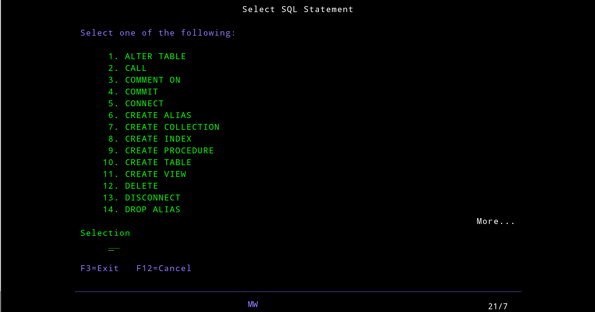
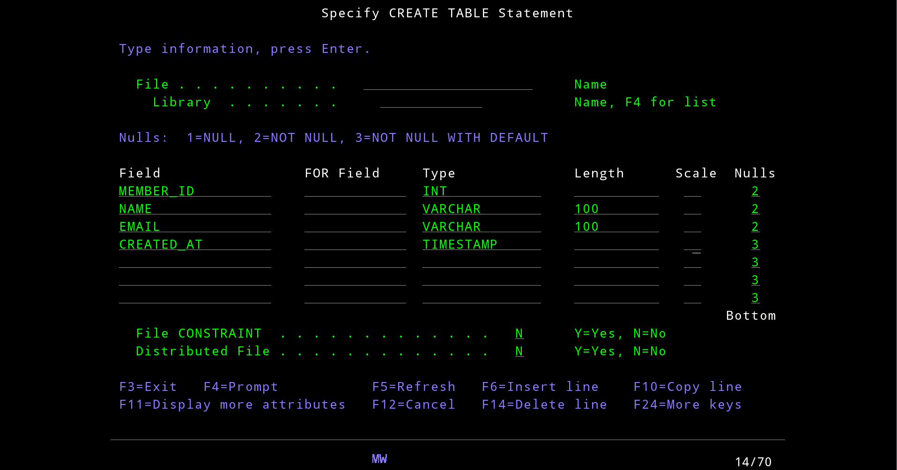
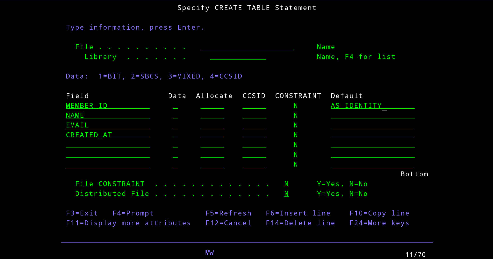
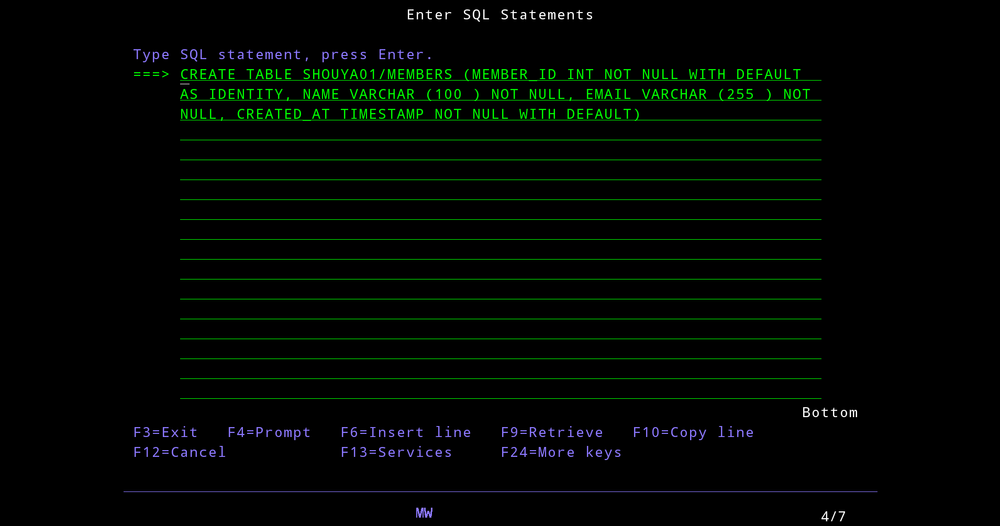
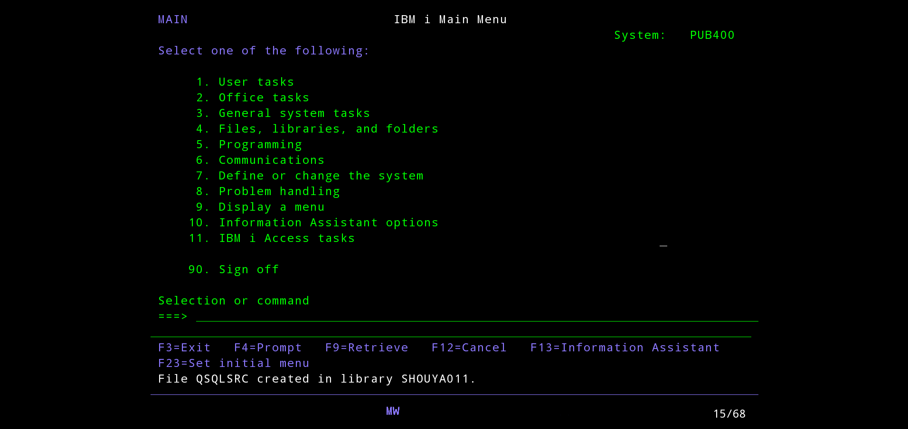
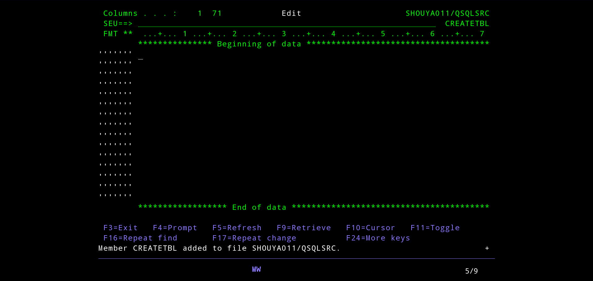
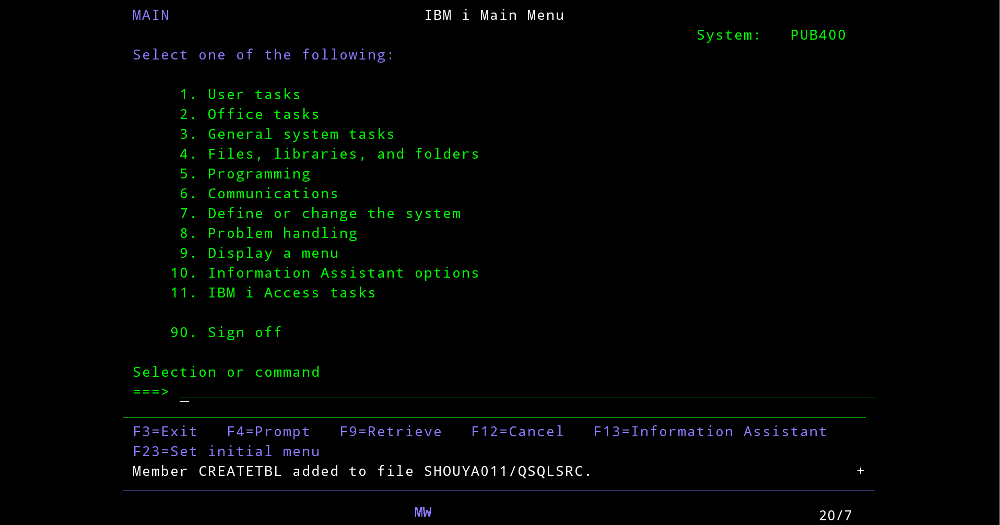
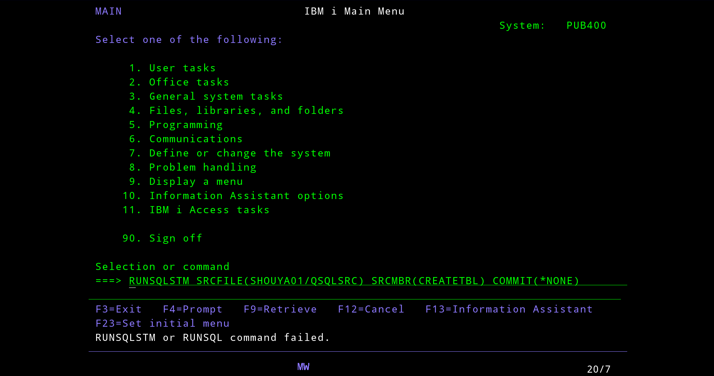
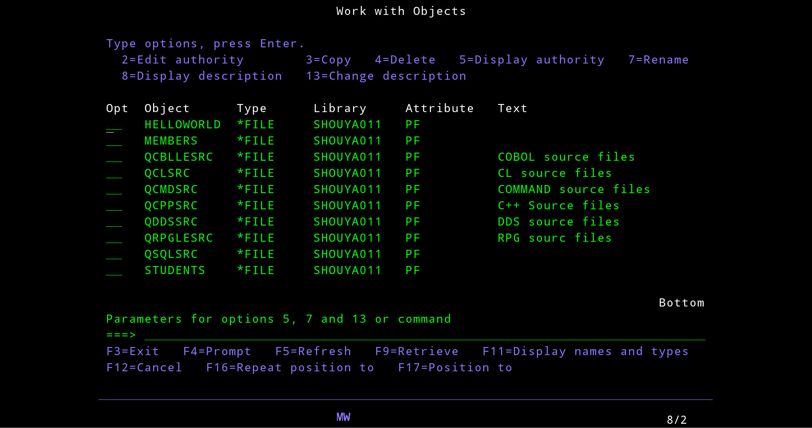

## Db2 for i

https://www.ibm.com/docs/en/i/7.5.0?topic=database

Db2 for i là hệ quản lý cơ sở dữ liệu quan hệ được tích hợp hoàn toàn trong hệ thống IBM i. Nhờ được tích hợp sẵn, nên rất dễ sử dụng và quản lý.

Cơ sở dữ liệu Db2 for i cũng cung cấp nhiều chức năng và tính năng như trigger, stored procedure và dynamic indexing bitmap, phục vụ cho nhiều loại ứng dụng khác nhau. Các ứng dụng này trải dài từ ứng dụng truyền thống chạy trên host, đến mô hình client/server, cho đến các ứng dụng phân tích kinh doanh (business intelligence).

## Các cách thao tác với DB

Có 4 loại:

- STRSQL (Start SQL Interactive Session)
- Prompt command (F4)
- SEU (Source Entry Utility)
- RUNSQLSTM (Run SQL from source)

STRSQL & Prompt (F4): Là cách làm việc trực tiếp (Interactive) -> gõ lệnh, nhấn Enter và bảng được tạo.

SEU & RUNSQLSTM: Là cách làm việc theo nguồn (Source-based) -> viết code vào một file, sau đó hệ thống đọc file đó để tạo bảng.

### 1. STRSQL (Start SQL Interactive Session)

STRSQL về bản chất là một SQL console chạy trực tiếp trong terminal 5250.

```cobol
STRSQL
```

Sau khi chạy, hệ thống sẽ hiển thị màn hình “Enter SQL Statements”.


Tại đây, bạn có thể nhập, chỉnh sửa, thực thi câu lệnh SQL. Các thông báo khi chạy SQL sẽ hiển thị trực tiếp trên màn hình này.

**Journal**


Trên IBM i, sau khi tạo bảng, hệ thống sẽ cảnh báo rằng chưa có journal.

journal giống như log của database, ghi lại mọi thay đổi (INSERT / UPDATE / DELETE). Dùng cho:

- Rollback / Recovery khi crash
- Audit dữ liệu
- High Availability (HA - Tính sẵn sàng cao), replication (đồng bộ)

Cách bật journaling:

Bước 1: Tạo journal receiver

```cobol
CRTJRNRCV JRNRCV(SHOUYA011/JRNRCV1)
```


Bước 2: Tạo journal

```
CRTJRN JRN(SHOUYA011/JRN1) JRNRCV(SHOUYA011/JRNRCV1)
```


Bước 3: Gắn file vào journal

```
STRJRNPF FILE(SHOUYA011/STUDENTS) JRN(SHOUYA011/JRN1)
```


### Thao tác với STRSQL

Tương tự với SQL thông thường

### 2. Prompt

Việc dùng màn hình Prompt (F4) cho các bảng có nhiều ràng buộc (Foreign Key, Identity) khá tốn thời gian vì phải chuyển qua lại nhiều màn hình -> cách sử dụng SQL command vẫn là tối ưu hơn.

Từ màn hình STRSQL, nhấn F4 sẽ hiển thị màn hình lựa chọn SQL Statement



Nhấn F10




Kết quả là gen ngược lại thành câu lệnh SQL.



**Chi tiết các tham số**

1. Header

| Tham số     | Ý nghĩa            | Chi tiết                                                            |
| :---------- | :----------------- | :------------------------------------------------------------------ |
| **File**    | Tên Table          | Tên vật lý của bảng (Physical File), tối đa 10 ký tự.               |
| **Library** | Thư viện           | Thư mục chứa bảng. Để trống sẽ mặc định vào \*CURLIB.               |
| **Data**    | Kiểu lưu trữ chung | 1=BIT, 2=SBCS (Single Byte), 3=MIXED, 4=CCSID (Chỉ định mã cụ thể). |

2. Body - dùng phím F11 để next page

| Tham số         | Ý nghĩa             | Cách dùng / Gợi ý                                                     |
| :-------------- | :------------------ | :-------------------------------------------------------------------- |
| **Field**       | Tên cột (SQL)       | Tên cột, tối đa 128 ký tự.                                            |
| **FOR Field**   | Tên hệ thống (ALIS) | Tên cột ngắn (tối đa 10 ký tự), dùng để làm alias khi field quá dài   |
| **Data (Type)** | Kiểu dữ liệu        | Nhập mã hoặc tên: INT, VARCHAR, TIMESTAMP, DECIMAL, DATE.             |
| **Length**      | Độ dài              | Số ký tự hoặc chữ số tối đa (ví dụ: 100 cho VARCHAR).                 |
| **Scale**       | Số thập phân        | Chỉ dùng cho DECIMAL (ví dụ: 2 cho số tiền 10,2).                     |
| **Nulls**       | Cho phép rỗng       | 1=NULL, 2=NOT NULL, 3=NOT NULL WITH DEFAULT.                          |
| **Allocate**    | Cấp phát trước      | Số byte dành riêng trong bộ nhớ chính để tăng hiệu suất truy xuất.    |
| **CCSID**       | Mã ngôn ngữ         | Dùng 1208 cho UTF-8 (hỗ trợ tiếng Việt có dấu).                       |
| **CONSTRAINT**  | Ràng buộc cột       | Đổi N -> Y để mở màn hình Primary Key, Unique, hoặc Check Constraint. |

3. Footer

| Tham số              | Ý nghĩa        | Lưu ý                                                                |
| :------------------- | :------------- | :------------------------------------------------------------------- |
| **File CONSTRAINT**  | Ràng buộc bảng | Đổi N -> Y để thiết lập FOREIGN KEY (Khóa ngoại) liên kết các bảng.  |
| **Distributed File** | File phân tán  | Mặc định là N. Chỉ dùng khi chạy trên hệ thống Cluster (Node Group). |

### 3. SEU + RUNSQLSTM

Create file

```
CRTSRCPF FILE(SHOUYA011/QSQLSRC) RCDLEN(112)
```



Mở trình soạn thảo SEU

```
STRSEU SRCFILE(SHOUYA01/QSQLSRC) SRCMBR(CREATETBL)
```



Trong màn hình SEU, tại dòng Type, hãy để là SQL (để hệ thống hỗ trợ định dạng và kiểm tra cú pháp SQL).

```
CREATE TABLE SHOUYA01.MEMBERS (
    MEMBER_ID INT PRIMARY KEY
        GENERATED ALWAYS AS IDENTITY,
    NAME VARCHAR(100),
    EMAIL VARCHAR(255) UNIQUE NOT NULL,
    CREATED_AT TIMESTAMP DEFAULT CURRENT_TIMESTAMP
);
```

Lưu ý: Lưu định dạng Type là SQL (mặc định là TXT -> Compile SQL sẽ lỗi)



Nhấn F3, sau đó chọn Y (Yes) tại mục Change/create member để lưu lại.

Chạy lệnh để thực thi

```
RUNSQLSTM SRCFILE(SHOUYA01/QSQLSRC) SRCMBR(CREATETBL) COMMIT(*NONE)
```

Nếu không đổi Type TXT -> SQL khi tạo SEU thì sẽ bị lỗi sau:



Kiểm tra sự tồn tại của bảng

```
WRKOBJ OBJ(SHOUYA011/*ALL) OBJTYPE(*FILE)
```



## Tổng hợp các từ khóa

### 1. command

| Lệnh          | Viết tắt của                                       | Ý nghĩa & Công dụng                                       |
| :------------ | :------------------------------------------------- | :-------------------------------------------------------- |
| **STRSQL**    | **STR**art **SQL**                                 | Mở giao diện nhập liệu SQL trực tiếp (Interactive SQL).   |
| **STRSEU**    | **STR**art **S**ource **E**ntry **U**tility        | Mở trình soạn thảo mã nguồn (viết code SQL, RPG, COBOL).  |
| **RUNSQLSTM** | **RUN** **SQL** **ST**ate**M**ent                  | Thực thi toàn bộ mã nguồn SQL từ một Member.              |
| **CRTLIB**    | **CR**ea**T**e **LIB**rary                         | Tạo mới một Thư viện (tương đương Database Schema).       |
| **CRTSRCPF**  | **CR**ea**T**e **S**ource **P**hysical **F**ile    | Tạo tệp vật lý dùng để chứa các tệp mã nguồn.             |
| **WRKOBJ**    | **W**o**RK** with **OBJ**ect                       | Quản lý các đối tượng (Table, Program, Library...).       |
| **WRKMBRPDM** | **W**o**RK** with **M**em**B**e**R** **PDM**       | Quản lý danh sách các Member (file code) trong một File.  |
| **WRKSPLF**   | **W**o**RK** with **S**poo**L** **F**ile           | Xem báo cáo hệ thống hoặc nội dung lỗi sau khi chạy lệnh. |
| **DSPFFD**    | **D**i**SP**lay **F**ile **F**ield **D**escription | Xem chi tiết định nghĩa các cột/trường của một bảng.      |
| **DSPJOBLOG** | **D**i**SP**lay **JOB** **LOG**                    | Xem nhật ký hoạt động để truy vết lỗi vừa xảy ra.         |

### 2. Tham số

| Tham số     | Viết tắt của                                   | Ý nghĩa                                                |
| :---------- | :--------------------------------------------- | :----------------------------------------------------- |
| **SRCFILE** | **S**ou**RC**e **FILE**                        | Tên tệp vật lý chứa các mã nguồn (ví dụ: QSQLSRC).     |
| **SRCMBR**  | **S**ou**RC**e **M**em**B**e**R**              | Tên thành viên/file code cụ thể (ví dụ: CREATETBL).    |
| **LIB**     | **LIB**rary                                    | Thư viện (ví dụ: SHOUYA011).                           |
| **OBJ**     | **OBJ**ect                                     | Đối tượng (Bảng, tệp, chương trình).                   |
| **RCDLEN**  | **R**e**C**or**D** **LEN**gth                  | Độ dài của một hàng dữ liệu (Record).                  |
| **CCSID**   | **C**oded **C**haracter **S**et **ID**entifier | Mã định danh bảng mã ngôn ngữ (ví dụ: 1208 cho UTF-8). |
| **CURLIB**  | **CUR**rent **LIB**rary                        | Thư viện hiện hành đang được gán cho User.             |

### 3. Thuật ngữ hệ thống

| Thuật ngữ | Viết tắt của                            | Ý nghĩa                                                |
| :-------- | :-------------------------------------- | :----------------------------------------------------- |
| **PDM**   | **P**rogram **D**evelopment **M**anager | Bộ công cụ quản lý phát triển chương trình.            |
| **SEU**   | **S**ource **E**ntry **U**tility        | Trình soạn thảo mã nguồn trên màn hình xanh.           |
| **PF**    | **P**hysical **F**ile                   | Tệp vật lý (Trong SQL tương đương với Table).          |
| **LF**    | **L**ogical **F**ile                    | Tệp logic (Trong SQL tương đương với View hoặc Index). |

Các từ khóa có dấu * ở phía trước (ví dụ: *CURLIB, *ALL, *NONE) được gọi là các Special Values. Hệ thống dùng dấu sao để phân biệt chúng với tên do người dùng tự đặt, tránh việc vô tình đặt tên một Library là "ALL" gây xung đột hệ thống.
