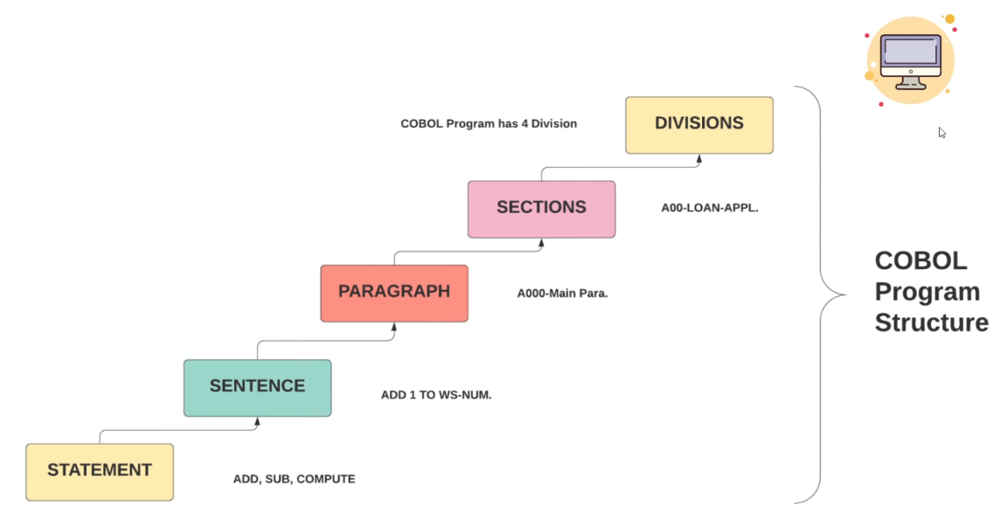
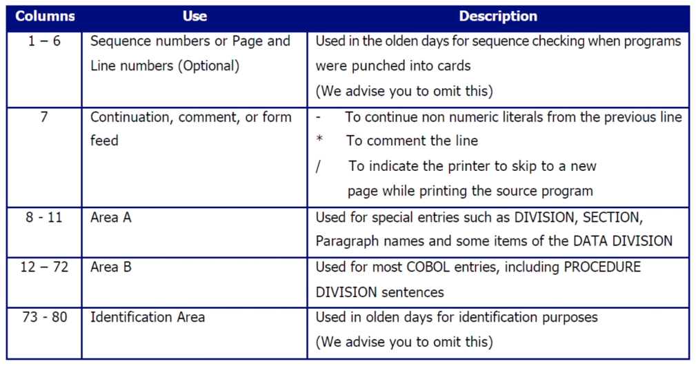
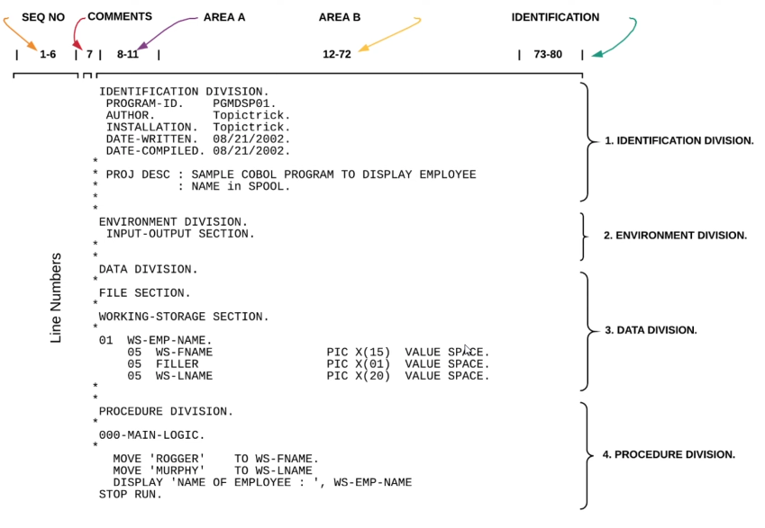

## Tổng quan về Cobol

Link tài liệu: https://www.ibm.com/docs/en/cobol-zos/6.4.0?topic=reference-cobol-language-structure  
Link slide overview COBOL: https://www.canva.com/design/DAG95yxe4mA/srA6-5UBWp92gZUSLvLN1A/view

### Install Cobol on Ubuntu

```
sudo apt install gnucobol4
```

Kiểm tra xem đã cài thành công chưa

```
whereis cobc; which cobc

cobc: /usr/bin/cobc /usr/share/man/man1/cobc.1.gz
/usr/bin/cobc
```

### Cấu trúc một chương trình Cobol



Cấu trúc một chương trình Cobol sẽ bao gồm 4 phân vùng (Division). Có thể lược bỏ một số phân vùng, tuy nhiên phải tuân theo thứ tự như sau:

1. **Identification Division**: cung cấp thông tin về chương trình cho lập trình viên và trình biên dịch.
2. **Environment Division**: giúp xác định các tệp đầu vào và đầu ra cho chương trình.
3. **Data Division**: bao gồm các thông tin khai báo biến dữ liệu
4. **Procedure Division**: bao gồm các mã lệnh sử dụng dùng để thao tác trên các thành phần dữ liệu đã được khai báo trong Data Division.

### Hello world với Cobol

Tạo file `helloworld.cbl` với nội dung như sau:

```
IDENTIFICATION DIVISION.
PROGRAM-ID. HELLO-WORLD.

PROCEDURE DIVISION.
    DISPLAY 'Hello world!'.
    STOP RUN.
```

Build file:

```bash
cobc -free -x hello_world.cbl
# OR
cobc -free -x -o <filename> hello_world.cbl
```

Thực thi file `hello_world` vừa được build phía trên:

```bash
./hello_world
```

### COBOL Formatter

Nếu không build file .cbl với param là `-free` thì sẽ xuất hiện lỗi như sau:

```
cobc -x hello_world.cbl

hello_world.cbl:1: error: invalid indicator 'F' at column 7
hello_world.cbl:2: error: invalid indicator 'M' at column 7
hello_world.cbl:4: error: invalid indicator 'U' at column 7
hello_world.cbl:5: error: invalid indicator 'S' at column 7
hello_world.cbl:6: error: invalid indicator 'O' at column 7
hello_world.cbl:7: error: PROGRAM-ID header missing
```

Nguyên nhân là COBOL cổ điển (Mainframe / AS400) dùng cấu trúc 80 cột gọi là Fixed Format, mỗi cột có ý nghĩa như sau:

| Cột   | Ý nghĩa                      |
| ----- | ---------------------------- |
| 1–6   | Số dòng                      |
| 7     | Indicator (`*`, `-`, `D`, …) |
| 8–11  | Vùng A                       |
| 12–72 | Vùng B                       |
| 73–80 | Comment / ignore             |

Nhưng nội dung file `hello_world.cbl` lại sử dụng cấu trúc Free Format `-free`, tức là không cần canh cột nên sẽ trả lỗi ở những vị trí tương ứng.

Trong quá trình thực hành, ta có thể sử dụng `-free` để code nhanh hơn. Tuy nhiên, khi làm việc thực tế trên những Mainframe / AS400 thì phải viết kiểu Fixed Format.

Nếu muốn viết kiểu Free Format thì cần chú ý thêm 7 khoảng trắng đầu ở mỗi dòng

```
       IDENTIFICATION DIVISION.
       PROGRAM-ID. HELLO-WORLD.

       PROCEDURE DIVISION.
           DISPLAY 'Hello world!'.
           STOP RUN.
```

Rồi build bình thường

```
cobc -x -o fixedFormat hello_world.cbl
./fixedFormat
```

### Cobol format

COBOL program phải viết chuẩn format mà compiler có thể hiểu và biên dịch được. Theo chuẩn ANSI, mỗi dòng code COBOL chứa tối đa 80 ký tự và được chia làm 5 vùng như sau:



| Cột (Columns) | Mục đích sử dụng (Use)                                                                            | Giải thích (Description)                                                                                                                                                                                                                    |
| ------------- | ------------------------------------------------------------------------------------------------- | ------------------------------------------------------------------------------------------------------------------------------------------------------------------------------------------------------------------------------------------- |
| **1 – 6**     | **Số thứ tự dòng (Sequence numbers)** hoặc **số trang/dòng (Page and Line numbers)** _(tùy chọn)_ | Dùng trong thời xưa để kiểm tra thứ tự dòng khi chương trình được **đục trên thẻ giấy (punch cards)**. <br> _Hiện nay không còn cần thiết_                                                                                                  |
| **7**         | **Dấu hiệu nối dòng, chú thích hoặc ngắt trang**                                                  | - Dấu **“-”**: dùng để **tiếp tục một chuỗi ký tự (literal)** từ dòng trước. <br>- Dấu **“\*”**: dùng để **ghi chú (comment)** — dòng sẽ không được biên dịch. <br>- Dấu **“/”**: ra lệnh cho máy in **bắt đầu trang mới** khi in mã nguồn. |
| **8 – 11**    | **Vùng A (Area A)**                                                                               | Dành cho các khai báo đặc biệt như **DIVISION**, **SECTION**, **tên đoạn (Paragraph names)**, và một số phần tử trong **DATA DIVISION**. <br>Đây là vùng bắt buộc cho các câu lệnh chính của COBOL.                                         |
| **12 – 72**   | **Vùng B (Area B)**                                                                               | Dành cho **hầu hết các câu lệnh trong COBOL**, đặc biệt là phần **PROCEDURE DIVISION** (phần logic/chương trình thực thi).                                                                                                                  |
| **73 – 80**   | **Vùng nhận dạng (Identification Area)**                                                          | Dùng ngày xưa để **ghi thông tin nhận dạng** (ví dụ số file, mã lập trình viên, v.v.) khi chương trình được lưu trên thẻ giấy.                                                                                                              |

Cấu trúc một chương trình Cobol có dạng như sau:



## Identification Division

**IDENTIFICATION DIVISION** được dùng để đặt tên cho chương trình và cung cấp thêm thông tin nhận dạng khác.

Có thể sử dụng các paragraph tùy chọn như **AUTHOR**, **INSTALLATION**, **DATE-WRITTEN**, và **DATE-COMPILED** để mô tả thêm thông tin về chương trình.

Dữ liệu được nhập trong đoạn **DATE-COMPILED** sẽ được tự động thay thế bằng ngày biên dịch mới nhất khi chương trình được biên dịch.

```
IDENTIFICATION DEVISION.
PROGRAM-ID.     HELLOWORLD.
AUTHOR.         QUYENNC.
DATE-WRITEEN.   04/11/2025.
DATE-COMPILED.  04/11/2025.
```

## Enviroment Division

**ENVIRONMENT DIVISION** là một optional DIVISION và bao gồm hai SECTION là:

- Configuration Section: xác định nơi chương trình nguồn được biên dịch (SOURCE-COMPUTER), và nơi chương trình sau khi biên dịch được chạy (OBJECT-COMPUTER).
- Input-Output Section: xác định các tệp đầu vào (input) và đầu ra (output) mà chương trình sử dụng.

Hầu hết các mục trong DIVISION này phụ thuộc vào máy tính hoặc hệ thống mà chương trình chạy.

```
ENVIRONMENT DIVISION.
CONFIGURATION SECTION.
    SOURCE-COMPUTER. IBM-370.
    OBJECT-COMPUTER. IBM-370.

INPUT-OUTPUT SECTION.
    FILE-CONTROL.
        SELECT EMP-FILE ASSIGN TO 'EMPLOYEE.DAT'.
    I-O CONTROL.
        <I-O Control entries>
```

_FILE-CONTROL xác định EMP-FILE là tên logic trong chương trình, được ánh xạ tới file thật "EMPLOYEE.DAT" trong hệ thống._

## Data Division

**DATA DIVISION** là phần dùng để khai báo các dữ liệu (data items) mà chương trình sẽ xử lý trong PROCEDURE DIVISION, bao gồm 7 section chính:

| Section                        | Chức năng                                                                                        |
| ------------------------------ | ------------------------------------------------------------------------------------------------ |
| 1. **FILE SECTION**            | Khai báo cấu trúc các file input/output, dùng chung với `FILE-CONTROL` ở `ENVIRONMENT DIVISION`. |
| 2. **WORKING-STORAGE SECTION** | Khai báo các biến tạm thời, lưu dữ liệu trong suốt quá trình chạy chương trình.                  |
| 3. **LOCAL-STORAGE SECTION**   | Giống `WORKING-STORAGE`, nhưng tự động khởi tạo lại mỗi lần chương trình được gọi.               |
| 4. **LINKAGE SECTION**         | Khai báo dữ liệu nhận từ chương trình khác (truyền tham số).                                     |
| 5. **COMMUNICATION SECTION**   | Dùng cho giao tiếp giữa các chương trình (communication lines).                                  |
| 6. **REPORT SECTION**          | Dùng để mô tả báo cáo .                                                                          |
| 7. **SCREEN SECTION**          | Dùng trong chương trình tương tác để hiển thị màn hình nhập/xuất.                                |

Đối với mỗi tệp tin mà một chương trình đọc hoặc ghi, cần phải viết một câu lệnh Select trong Environment Division và một câu lệnh FD (File Description) trong Data Division.

Bởi vì câu lệnh Select cho chương trình COBOL nội bộ khác với trên mainframe COBOL, cú pháp sử dụng cho mỗi nền tảng sẽ được trình bày riêng biệt.

```
DATA DIVISION.
FILE SECTION.
FD  INPUT-FILE.
01  CUSTOMER-RECORD.
    05  CUST-ID      PIC 9(5).
    05  CUST-NAME    PIC A(20).

WORKING-STORAGE SECTION.
01  WS-TOTAL-CUSTOMERS  PIC 9(4) VALUE 0.

LOCAL-STORAGE SECTION.
01  TEMP-NAME  PIC A(20).

LINKAGE SECTION.
01  PASSED-NUMBER  PIC 9(3).

SCREEN SECTION.
01  DISPLAY-SCREEN.
    05  BLANK SCREEN.
    05  LINE 10 COLUMN 20 VALUE "ENTER NAME:".
    05  LINE 10 COLUMN 35 PIC A(20) TO TEMP-NAME.

```

## Procedure Division

PROCEDURE DIVISION là KHỐI quan trọng nhất của một chương trình COBOL. Nó bao gồm các câu lệnh (statements) và câu (sentences) cần thiết để đọc dữ liệu đầu vào, xử lý dữ liệu đó và ghi dữ liệu đầu ra.

```
PROCEDURE DIVISION.
    A000-START-PROGRAM.
        DISPLAY "ようこそ、異世界へ"

    B000-END-PROGRAM.
        STOP RUN.
```

Trong PROCEDURE DIVISION, mã được tổ chức theo cấp bậc:

```
MAIN-PARA.
    MOVE "HELLO" TO WS-MESSAGE.
    MOVE A TO B
    MOVE C TO D
    COMPUTE E = C + D.
    DISPLAY WS-MESSAGE.
```

- Statement: Là một lệnh nhỏ lẻ để thực hiện một hành động

  Vd: `MOVE A TO B`, `MOVE C TO D`

- Sentence: Là một hoặc nhiều câu lệnh COBOL kết thúc bằng một dấu chấm.

  Vd:

  ```
  MOVE A TO B
  MOVE C TO D
  COMPUTE E = C + D.
  ```

- Paragraph: bao gồm một hoặc nhiều Sentence.

- Section: Là một nhóm các paragraph liên quan, chia làm 7 sections.
